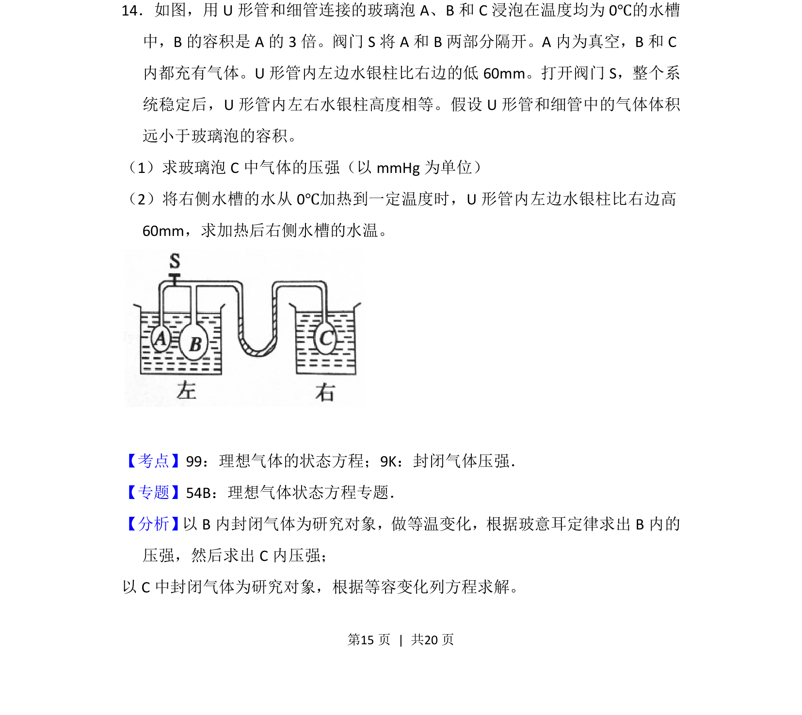

## 题面

## 摘要

以B和C中气体为对象，结合等温变化与等容变化求解压强和温度

## 关联考点

- [[446-理想气体状态方程|理想气体状态方程]]
- [[封闭气体压强]]
- [[444-玻意耳定律|等温变化]]
- [[430-查理定律|等容变化]]

## 答案与解析

> 📄 原 PDF 第 15 页：`素材/真题/吉林/2008-2024·（吉林）物理高考真题/2012年高考物理试卷（新课标）（解析卷）.pdf`
