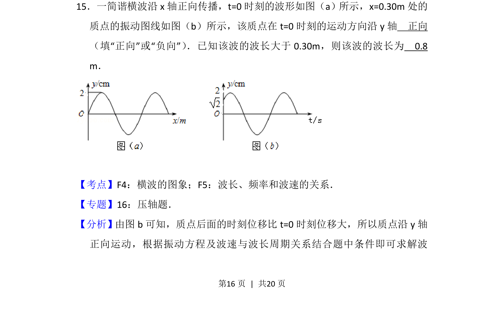
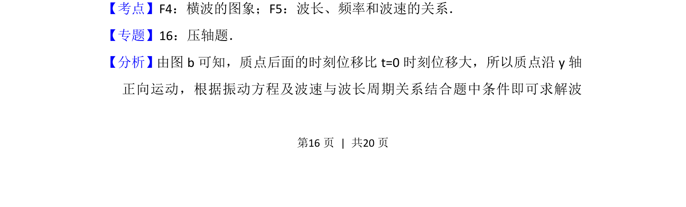
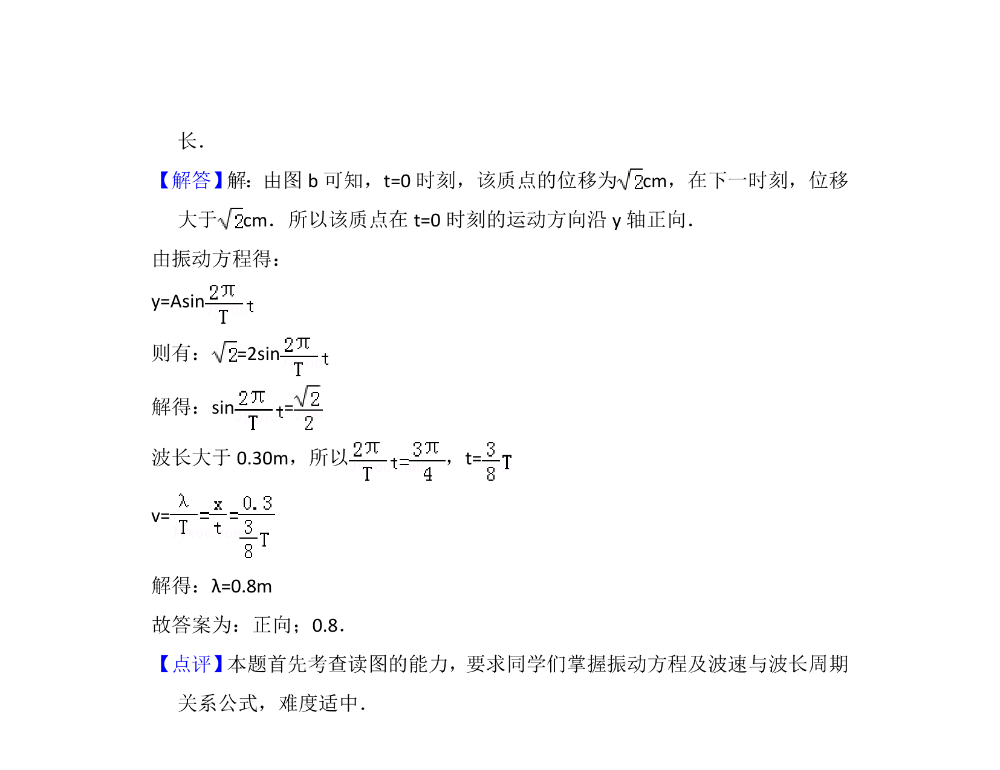

## 题面

## 摘要

根据振动图像判断质点运动方向，结合波长条件求解波长。

## 关联考点

- [[630-横波的图象|横波的图象]]
- [[370-波长|波长]]
- [[749-频率和波速的关系|频率和波速的关系]]

## 答案与解析

> 📄 原 PDF 第 16 页：`素材/真题/吉林/2008-2024·（吉林）物理高考真题/2012年高考物理试卷（新课标）（解析卷）.pdf`
