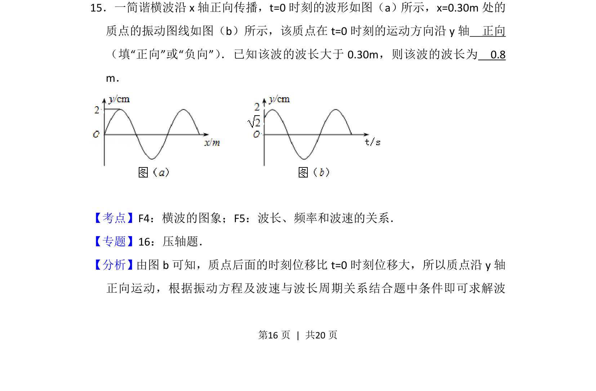
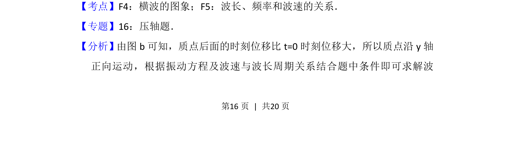
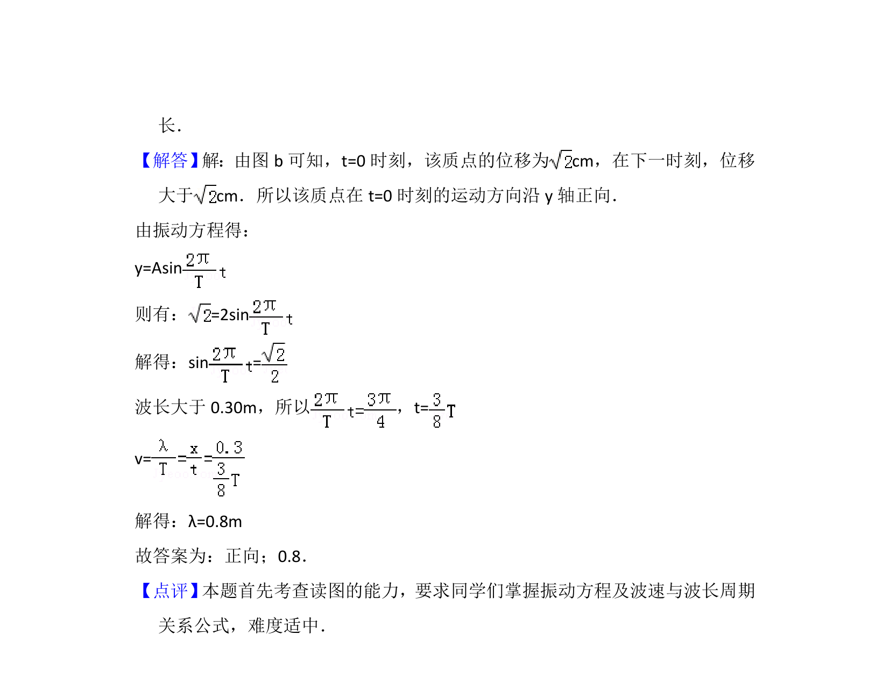

## 题面

## 摘要

根据振动图像判断质点运动方向，结合波长条件求解波长。

## 关联考点

- [[630-横波的图象|横波的图象]]
- [[370-波长|波长]]
- [[749-频率和波速的关系|频率和波速的关系]]

## 答案与解析

> 📄 原 PDF 第 16 页：`素材/真题/吉林/2008-2024·（吉林）物理高考真题/2012年高考物理试卷（新课标）（解析卷）.pdf`

<!-- 题干文本-start -->
## 题干文本
15．一简谐横波沿x轴正向传播，t=0时刻的波形如图（a）所示，x=0.30m处的
质点的振动图线如图（b）所示，该质点在t=0时刻的运动方向沿y轴　正向　
（填“正向”或“负向”） ．已知该波的波长大于0.30m，则该波的波长为　0.8　
m．
<!-- 题干文本-end -->

<!-- 解析文本-start -->
## 解析文本
【考点】F4：横波的图象；F5：波长、频率和波速的关系．菁优网版权所有
【专题】16：压轴题．
【分析】由图b可知，质点后面的时刻位移比t=0时刻位移大，所以质点沿y轴
正向运动，根据振动方程及波速与波长周期关系结合题中条件即可求解波
<!-- 解析文本-end -->
