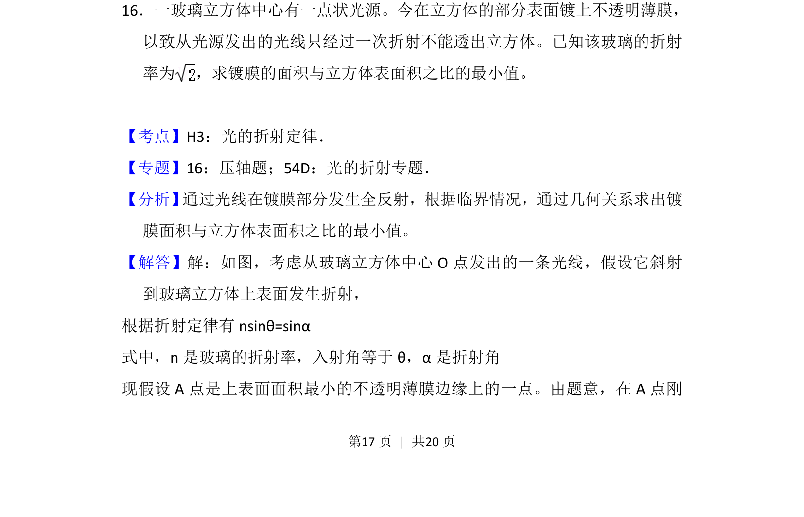
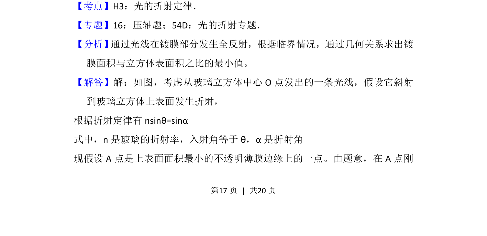
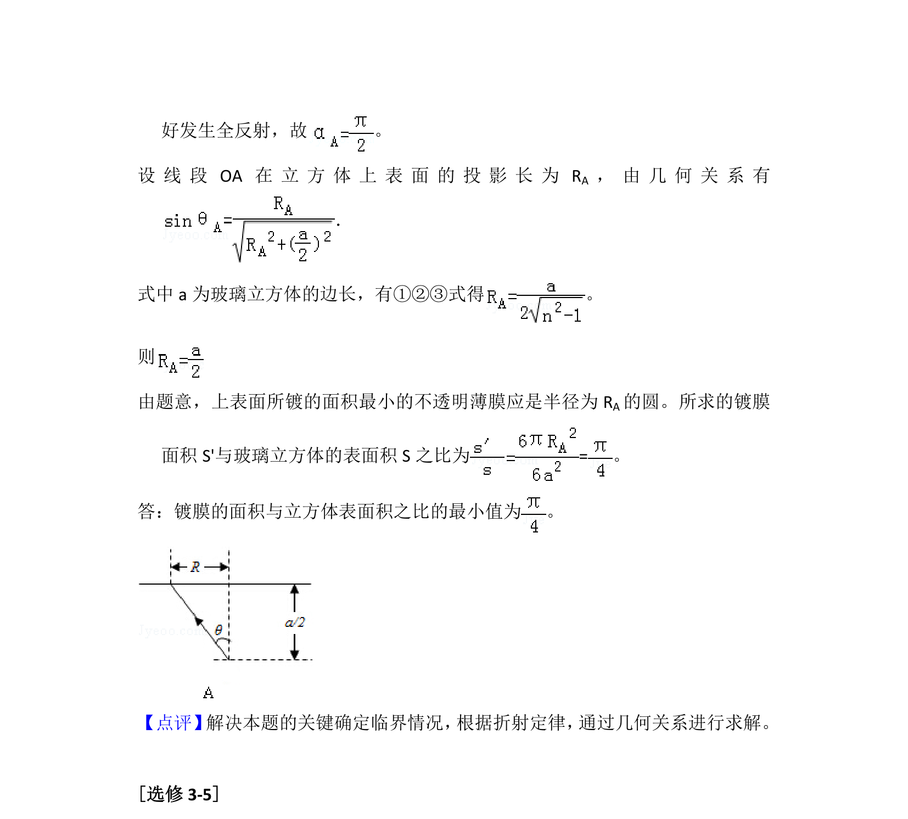

## 题面

## 摘要

光学折射与全反射在立方体内求最小镀膜面积比

## 关联考点

- [[520-光的折射定律|光的折射定律]]
- [[343-全反射|全反射]]
- [[455-几何光学|几何光学]]
- [[506-临界条件|临界条件]]

## 答案与解析

> 📄 原 PDF 第 17 页：`素材/真题/吉林/2008-2024·（吉林）物理高考真题/2012年高考物理试卷（新课标）（解析卷）.pdf`

<!-- 题干文本-start -->
## 题干文本
16．一玻璃立方体中心有一点状光源。今在立方体的部分表面镀上不透明薄膜，
以致从光源发出的光线只经过一次折射不能透出立方体。已知该玻璃的折射
率为 ，求镀膜的面积与立方体表面积之比的最小值。
<!-- 题干文本-end -->

<!-- 解析文本-start -->
## 解析文本
【考点】H3：光的折射定律．菁优网版权所有
【专题】16：压轴题；54D：光的折射专题．
【分析】 通过光线在镀膜部分发生全反射，根据临界情况，通过几何关系求出镀
膜面积与立方体表面积之比的最小值。
【解答】解：如图，考虑从玻璃立方体中心O点发出的一条光线，假设它斜射
到玻璃立方体上表面发生折射，
根据折射定律有nsinθ=sinα     
式中，n是玻璃的折射率，入射角等于θ，α是折射角
现假设A点是上表面面积最小的不透明薄膜边缘上的一点。由题意，在A点刚
<!-- 解析文本-end -->
