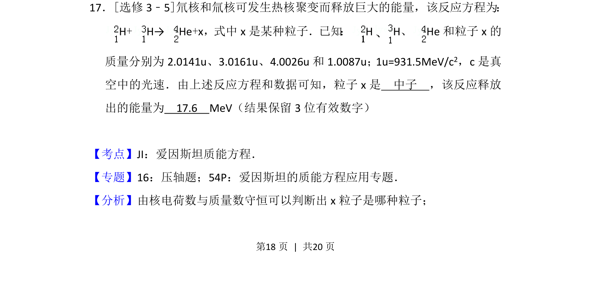
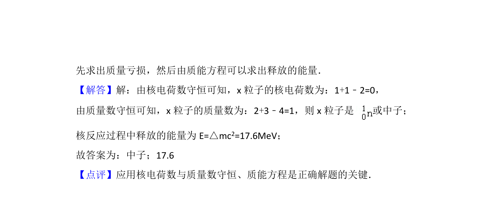

## 题面

## 摘要

核反应方程粒子推断及利用质能方程计算聚变释放能量

## 关联考点

- [[629-核反应方程|核反应方程]]
- [[449-质能方程|质量亏损]]
- [[449-质能方程|质能方程]]

## 答案与解析

> 📄 原 PDF 第 18 页：`素材/真题/吉林/2008-2024·（吉林）物理高考真题/2012年高考物理试卷（新课标）（解析卷）.pdf`
