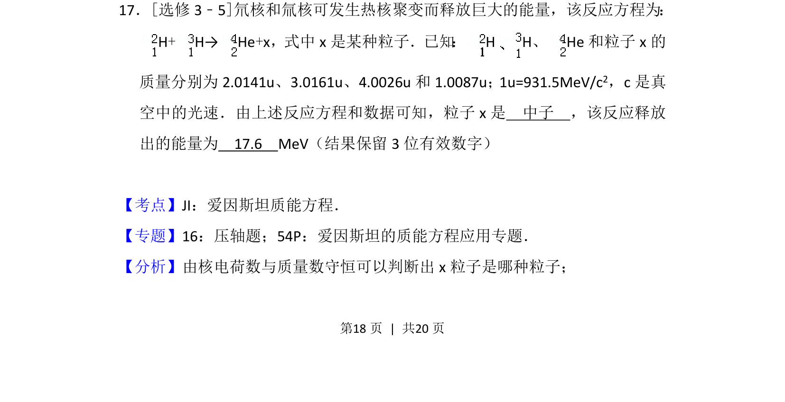
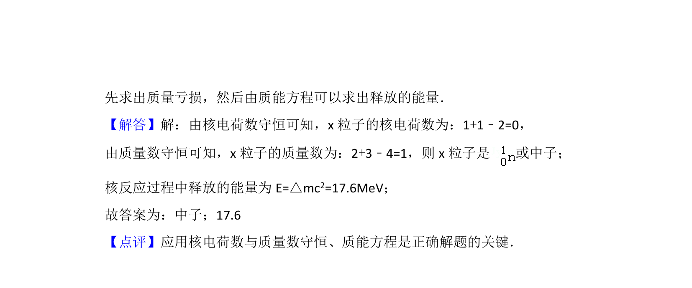

## 题面

## 摘要

核反应方程粒子推断及利用质能方程计算聚变释放能量

## 关联考点

- [[629-核反应方程|核反应方程]]
- [[449-质能方程|质量亏损]]
- [[449-质能方程|质能方程]]

## 答案与解析

> 📄 原 PDF 第 18 页：`素材/真题/吉林/2008-2024·（吉林）物理高考真题/2012年高考物理试卷（新课标）（解析卷）.pdf`

<!-- 题干文本-start -->
## 题干文本
17．[选修3﹣5]氘核和氚核可发生热核聚变而释放巨大的能量，该反应方程为：
H+H→He+x，式中x是某种粒子．已知 ：H H、He和粒子x的
质量分别为2.0141u、3.0161u、4.0026u和1.0087u；1u=931.5MeV/c 2，c是真
空中的光速．由上述反应方程和数据可知，粒子x是　中子　，该反应释放
出的能量为　17.6　MeV（结果保留3位有效数字）
<!-- 题干文本-end -->

<!-- 解析文本-start -->
## 解析文本
【考点】JI：爱因斯坦质能方程．菁优网版权所有
【专题】16：压轴题；54P：爱因斯坦的质能方程应用专题．
【分析】由核电荷数与质量数守恒可以判断出x粒子是哪种粒子；
<!-- 解析文本-end -->
