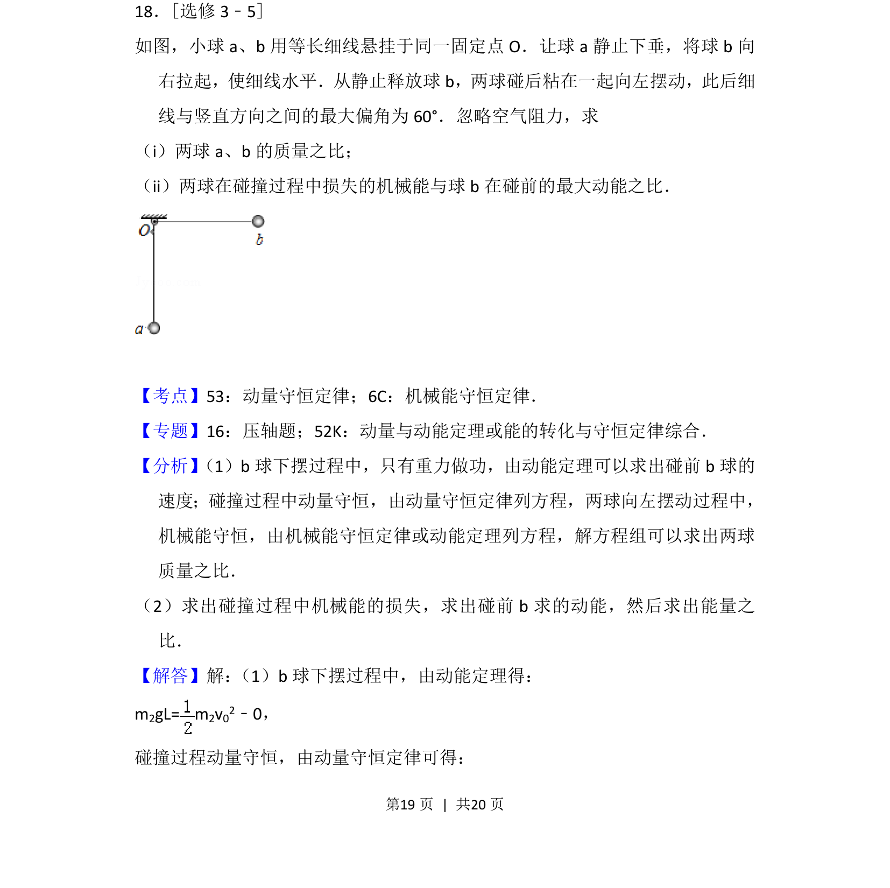

## 题面

## 摘要

两球碰撞后粘合摆动，通过动能定理和动量守恒求质量比及机械能损失比。

## 关联考点

- [[347-动量守恒定律|动量守恒定律]]
- [[085-机械能守恒-初中|机械能守恒定律]]
- [[251-动能定理|动能定理]]

## 答案与解析

> 📄 原 PDF 第 19 页：`素材/真题/吉林/2008-2024·（吉林）物理高考真题/2012年高考物理试卷（新课标）（解析卷）.pdf`
