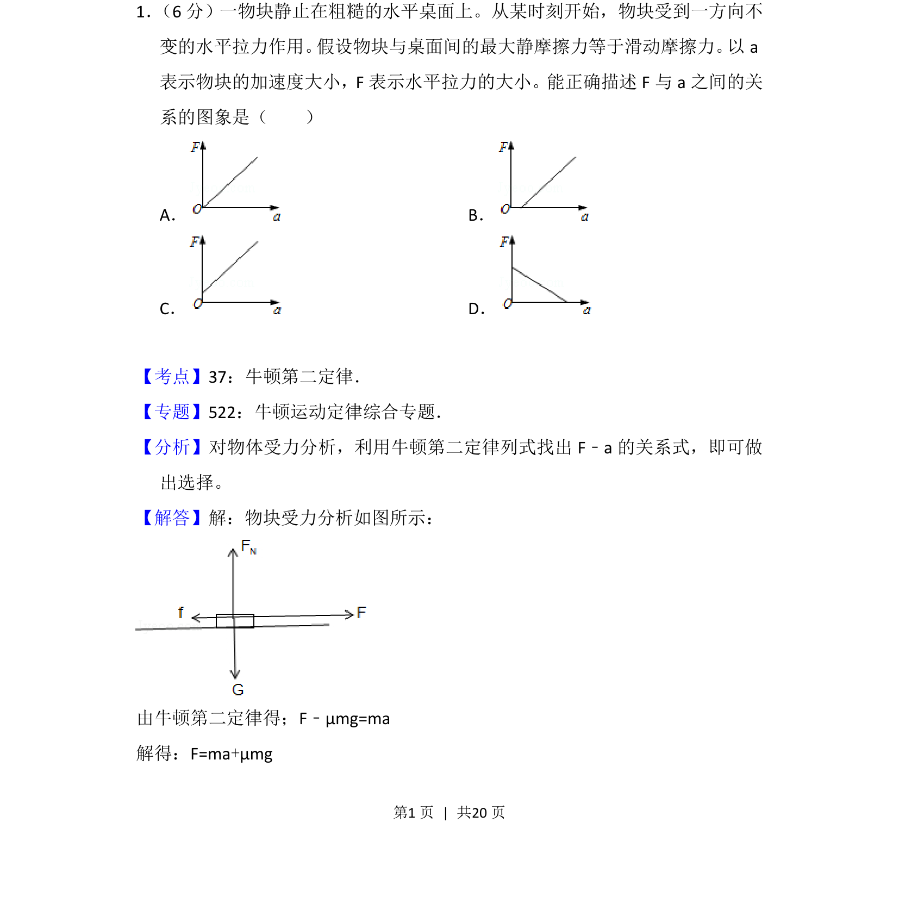
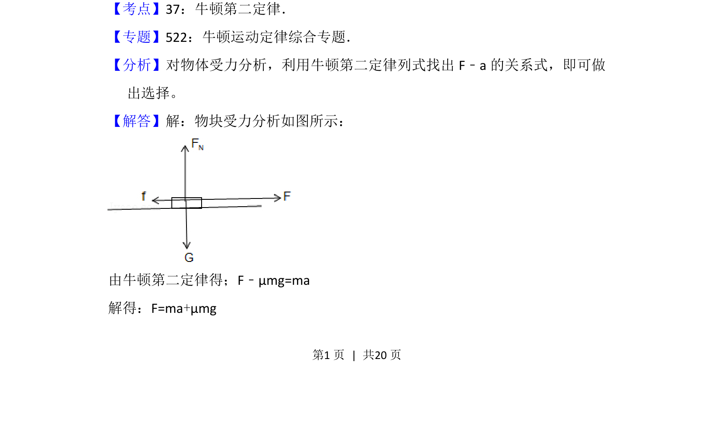
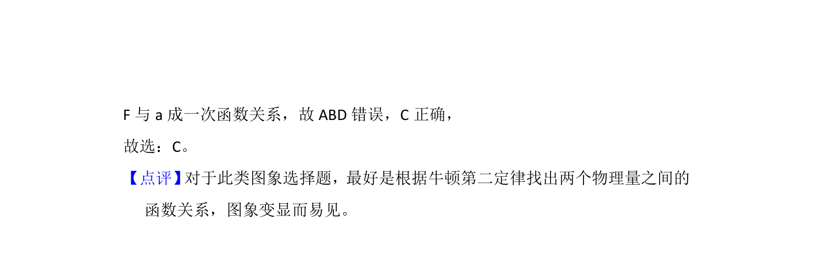

## 题面

## 摘要

物块在粗糙水平面受水平拉力，考查F与a关系图象及牛顿第二定律的应用。

## 关联考点

- [[229-牛顿第二定律|牛顿第二定律]]
- [[097-滑动摩擦力|滑动摩擦力]]
- [[最大静摩擦力]]
- [[F-a图象]]

## 答案与解析

> 📄 原 PDF 第 1 页：`素材/真题/吉林/2008-2024·（吉林）物理高考真题/2013年高考物理试卷（新课标Ⅱ）（解析卷）.pdf`
