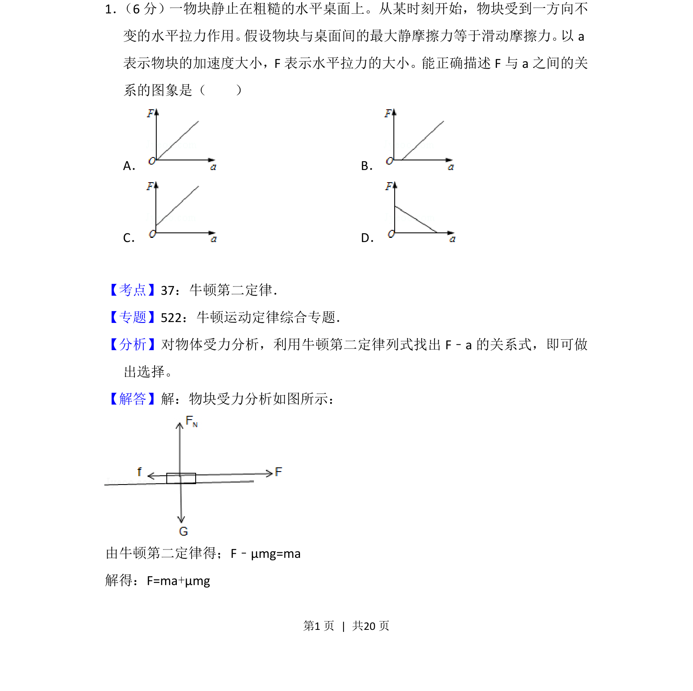
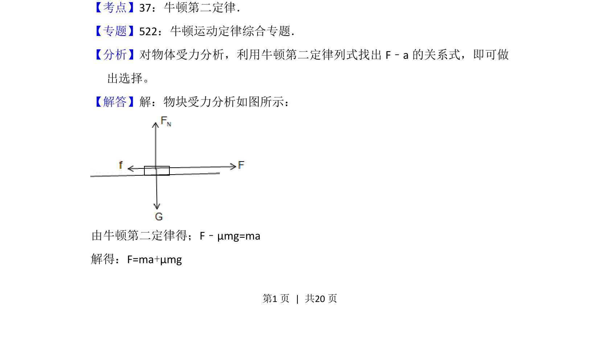
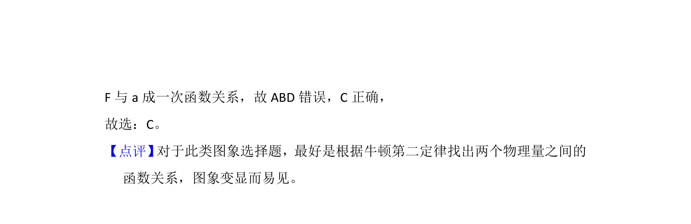

## 题面

## 摘要

物块在粗糙水平面受水平拉力，考查F与a关系图象及牛顿第二定律的应用。

## 关联考点

- [[229-牛顿第二定律|牛顿第二定律]]
- [[097-滑动摩擦力|滑动摩擦力]]
- [[776-最大静摩擦力|最大静摩擦力]]
- [[494-F-a图象|F-a图象]]

## 答案与解析

> 📄 原 PDF 第 1 页：`素材/真题/吉林/2008-2024·（吉林）物理高考真题/2013年高考物理试卷（新课标Ⅱ）（解析卷）.pdf`

<!-- 题干文本-start -->
## 题干文本
1． （6分）一物块静止在粗糙的水平桌面上。从某时刻开始，物块受到一方向不
变的水平拉力作用。 假设物块与桌面间的最大静摩擦力等于滑动摩擦力。 以a
表示物块的加速度大小，F表示水平拉力的大小。能正确描述F与a之间的关
系的图象是（　　）
A．B．
C．D．
<!-- 题干文本-end -->

<!-- 解析文本-start -->
## 解析文本
【考点】37：牛顿第二定律．菁优网版权所有
【专题】522：牛顿运动定律综合专题．
【分析】对物体受力分析，利用牛顿第二定律列式找出F﹣a的关系式，即可做
出选择。
【解答】解：物块受力分析如图所示：
由牛顿第二定律得；F﹣μmg=ma
解得：F=ma+μmg
<!-- 解析文本-end -->
