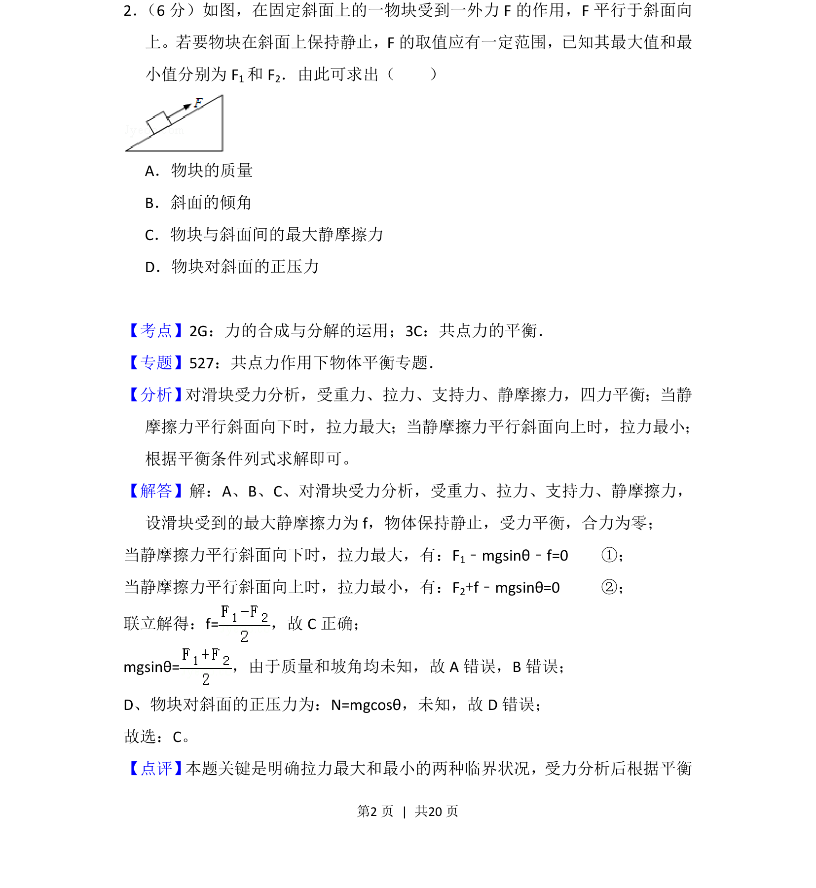
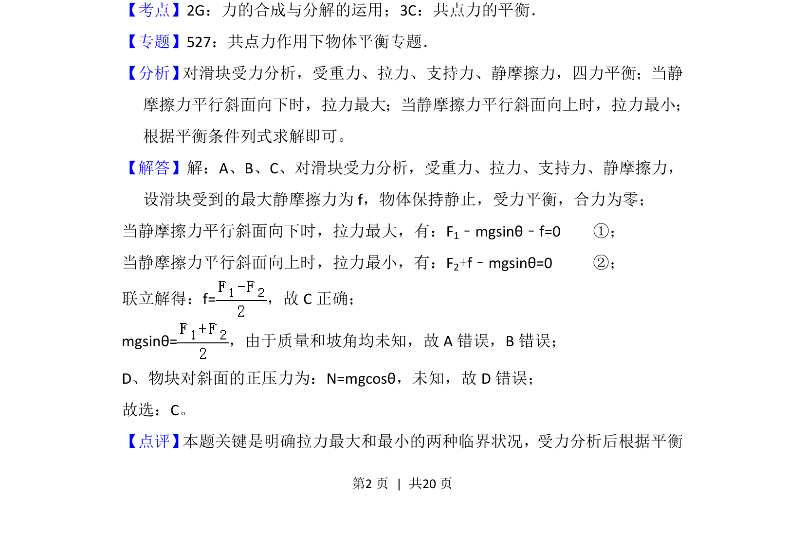

## 题面

## 摘要

该题考查斜面上物块在变化外力下保持静止时临界平衡条件，通过最大和最小拉力求解最大静摩擦力。

## 关联考点

- [[532-力的合成与分解|力的合成与分解]]
- [[208-共点力平衡|共点力平衡]]
- [[081-摩擦力|摩擦力]]

## 答案与解析

> 📄 原 PDF 第 2 页：`素材/真题/吉林/2008-2024·（吉林）物理高考真题/2013年高考物理试卷（新课标Ⅱ）（解析卷）.pdf`
