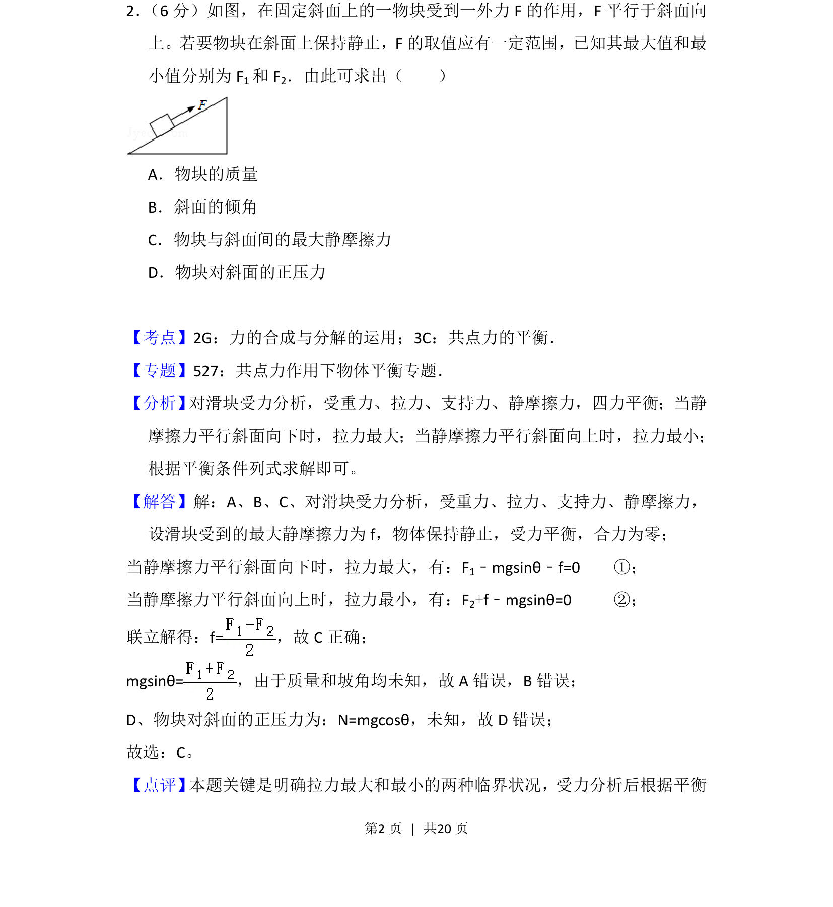
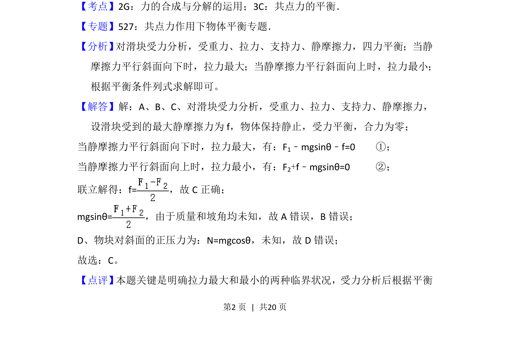

## 题面

## 摘要

该题考查斜面上物块在变化外力下保持静止时临界平衡条件，通过最大和最小拉力求解最大静摩擦力。

## 关联考点

- [[532-力的合成与分解|力的合成与分解]]
- [[208-共点力平衡|共点力平衡]]
- [[081-摩擦力|摩擦力]]

## 答案与解析

> 📄 原 PDF 第 2 页：`素材/真题/吉林/2008-2024·（吉林）物理高考真题/2013年高考物理试卷（新课标Ⅱ）（解析卷）.pdf`

<!-- 题干文本-start -->
## 题干文本
2． （6分）如图，在固定斜面上的一物块受到一外力F的作用，F平行于斜面向
上。若要物块在斜面上保持静止，F的取值应有一定范围，已知其最大值和最
小值分别为F 1和F 2．由此可求出（　　）
A．物块的质量
B．斜面的倾角
C．物块与斜面间的最大静摩擦力
D．物块对斜面的正压力
<!-- 题干文本-end -->

<!-- 解析文本-start -->
## 解析文本
【考点】2G：力的合成与分解的运用；3C：共点力的平衡．菁优网版权所有
【专题】527：共点力作用下物体平衡专题．
【分析】 对滑块受力分析，受重力、拉力、支持力、静摩擦力，四力平衡；当静
摩擦力平行斜面向下时，拉力最大；当静摩擦力平行斜面向上时，拉力最小；
根据平衡条件列式求解即可。
【解答】解：A、B、C、对滑块受力分析，受重力、拉力、支持力、静摩擦力，
设滑块受到的最大静摩擦力为f，物体保持静止，受力平衡，合力为零；
当静摩擦力平行斜面向下时，拉力最大，有：F1﹣mgsinθ﹣f=0    ①；
当静摩擦力平行斜面向上时，拉力最小，有：F2+f﹣mgsinθ=0     ②；
联立解得：f=，故C正确；
mgsinθ=，由于质量和坡角均未知，故A错误，B错误；
D、物块对斜面的正压力为：N=mgcosθ，未知，故D错误；
故选：C。
【点评】 本题关键是明确拉力最大和最小的两种临界状况，受力分析后根据平衡
<!-- 解析文本-end -->
