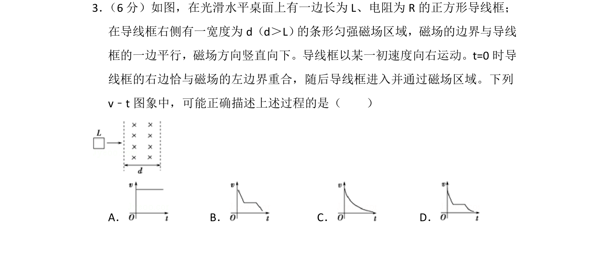
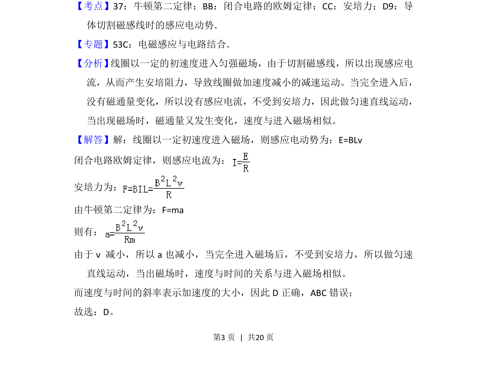

## 题面

## 摘要

导线框进入和穿出磁场时受安培力做减速运动，完全在磁场中匀速，v-t图斜率反映加速度变化。

## 关联考点

- [[175-电磁感应|电磁感应]]
- [[188-磁场对通电导体的作用|安培力]]
- [[229-牛顿第二定律|牛顿第二定律]]
- [[332-闭合电路欧姆定律|闭合电路欧姆定律]]

## 答案与解析

> 📄 原 PDF 第 3 页：`素材/真题/吉林/2008-2024·（吉林）物理高考真题/2013年高考物理试卷（新课标Ⅱ）（解析卷）.pdf`
