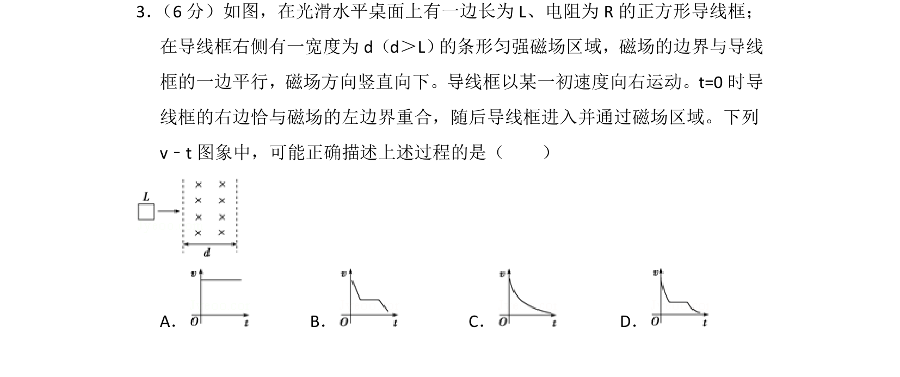
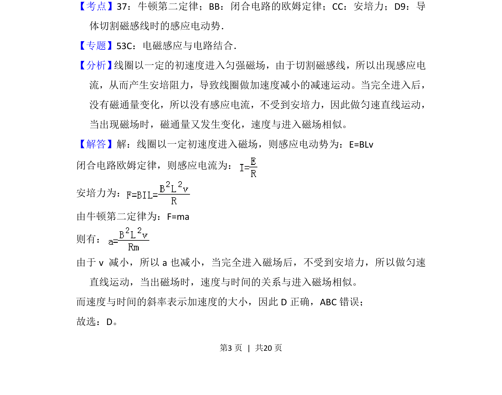

## 题面

## 摘要

导线框进入和穿出磁场时受安培力做减速运动，完全在磁场中匀速，v-t图斜率反映加速度变化。

## 关联考点

- [[175-电磁感应|电磁感应]]
- [[188-磁场对通电导体的作用|安培力]]
- [[229-牛顿第二定律|牛顿第二定律]]
- [[332-闭合电路欧姆定律|闭合电路欧姆定律]]

## 答案与解析

> 📄 原 PDF 第 3 页：`素材/真题/吉林/2008-2024·（吉林）物理高考真题/2013年高考物理试卷（新课标Ⅱ）（解析卷）.pdf`

<!-- 题干文本-start -->
## 题干文本
3． （6分）如图，在光滑水平桌面上有一边长为L、电阻为R的正方形导线框；
在导线框右侧有一宽度为d（d＞L） 的条形匀强磁场区域，磁场的边界与导线
框的一边平行，磁场方向竖直向下。导线框以某一初速度向右运动。t=0时导
线框的右边恰与磁场的左边界重合，随后导线框进入并通过磁场区域。下列
v﹣t图象中，可能正确描述上述过程的是（　　）
A．B．C．D．
<!-- 题干文本-end -->

<!-- 解析文本-start -->
## 解析文本
【考点】37：牛顿第二定律；BB：闭合电路的欧姆定律；CC：安培力；D9：导
体切割磁感线时的感应电动势．菁优网版权所有
【专题】53C：电磁感应与电路结合．
【分析】 线圈以一定的初速度进入匀强磁场，由于切割磁感线，所以出现感应电
流，从而产生安培阻力，导致线圈做加速度减小的减速运动。当完全进入后，
没有磁通量变化，所以没有感应电流，不受到安培力，因此做匀速直线运动，
当出现磁场时，磁通量又发生变化，速度与进入磁场相似。
【解答】解：线圈以一定初速度进入磁场，则感应电动势为：E=BLv 
闭合电路欧姆定律，则感应电流为：  
安培力为：   
由牛顿第二定律为：F=ma  
则有：
由于v 减小，所以a也减小，当完全进入磁场后，不受到安培力，所以做匀速
直线运动，当出磁场时，速度与时间的关系与进入磁场相似。
而速度与时间的斜率表示加速度的大小，因此D正确，ABC错误；
故选：D。
<!-- 解析文本-end -->
