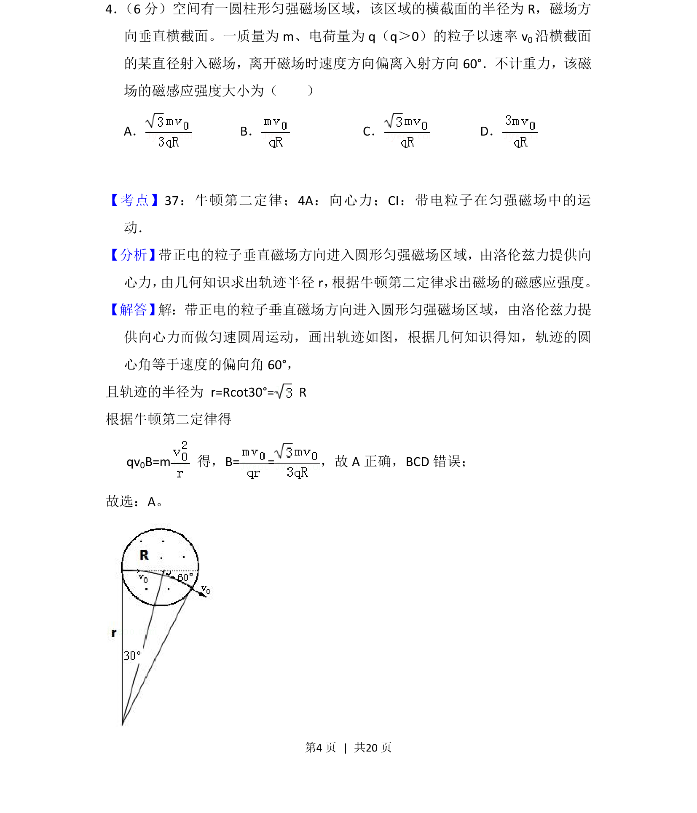

## 题面

## 摘要

带电粒子垂直射入圆形匀强磁场，由几何关系和洛伦兹力提供向心力求解磁感应强度。

## 关联考点

- [[带电粒子在匀强磁场中的运动]]
- [[256-向心力|向心力]]
- [[229-牛顿第二定律|牛顿第二定律]]
- [[几何关系]]

## 答案与解析

> 📄 原 PDF 第 4 页：`素材/真题/吉林/2008-2024·（吉林）物理高考真题/2013年高考物理试卷（新课标Ⅱ）（解析卷）.pdf`
