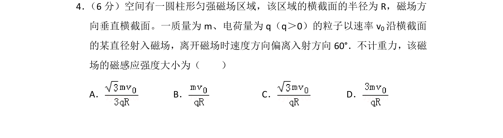
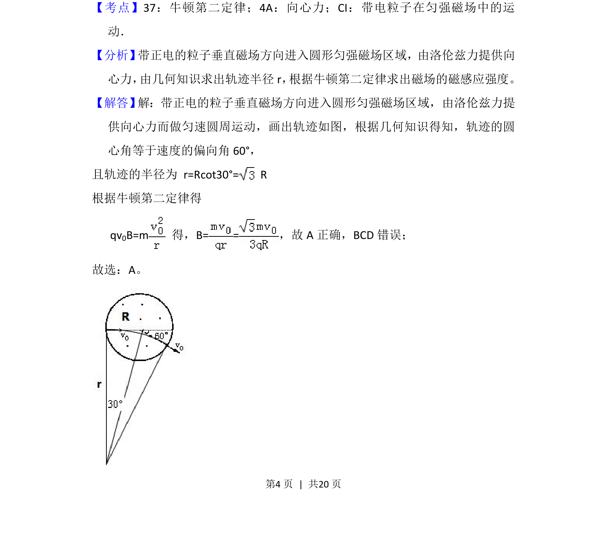

## 题面

## 摘要

带电粒子垂直射入圆形匀强磁场，由几何关系和洛伦兹力提供向心力求解磁感应强度。

## 关联考点

- [[595-带电粒子在匀强磁场中的运动|带电粒子在匀强磁场中的运动]]
- [[256-向心力|向心力]]
- [[229-牛顿第二定律|牛顿第二定律]]
- [[456-几何关系|几何关系]]

## 答案与解析

> 📄 原 PDF 第 4 页：`素材/真题/吉林/2008-2024·（吉林）物理高考真题/2013年高考物理试卷（新课标Ⅱ）（解析卷）.pdf`

<!-- 题干文本-start -->
## 题干文本
4． （6分）空间有一圆柱形匀强磁场区域，该区域的横截面的半径为R，磁场方
向垂直横截面。一质量为m、电荷量为q（q＞0）的粒子以速率v 0沿横截面
的某直径射入磁场，离开磁场时速度方向偏离入射方向60°．不计重力，该磁
场的磁感应强度大小为（　　）
A．B．C．D．
<!-- 题干文本-end -->

<!-- 解析文本-start -->
## 解析文本
【考点】37：牛顿第二定律；4A：向心力；CI：带电粒子在匀强磁场中的运
动．菁优网版权所有
【分析】 带正电的粒子垂直磁场方向进入圆形匀强磁场区域，由洛伦兹力提供向
心力， 由几何知识求出轨迹半径r， 根据牛顿第二定律求出磁场的磁感应强度。
【解答】 解：带正电的粒子垂直磁场方向进入圆形匀强磁场区域，由洛伦兹力提
供向心力而做匀速圆周运动，画出轨迹如图，根据几何知识得知，轨迹的圆
心角等于速度的偏向角60°，
且轨迹的半径为 r=Rcot30°=  R
根据牛顿第二定律得
   qv 0B=m  得，B= =，故A正确，BCD错误；
故选：A。
<!-- 解析文本-end -->
