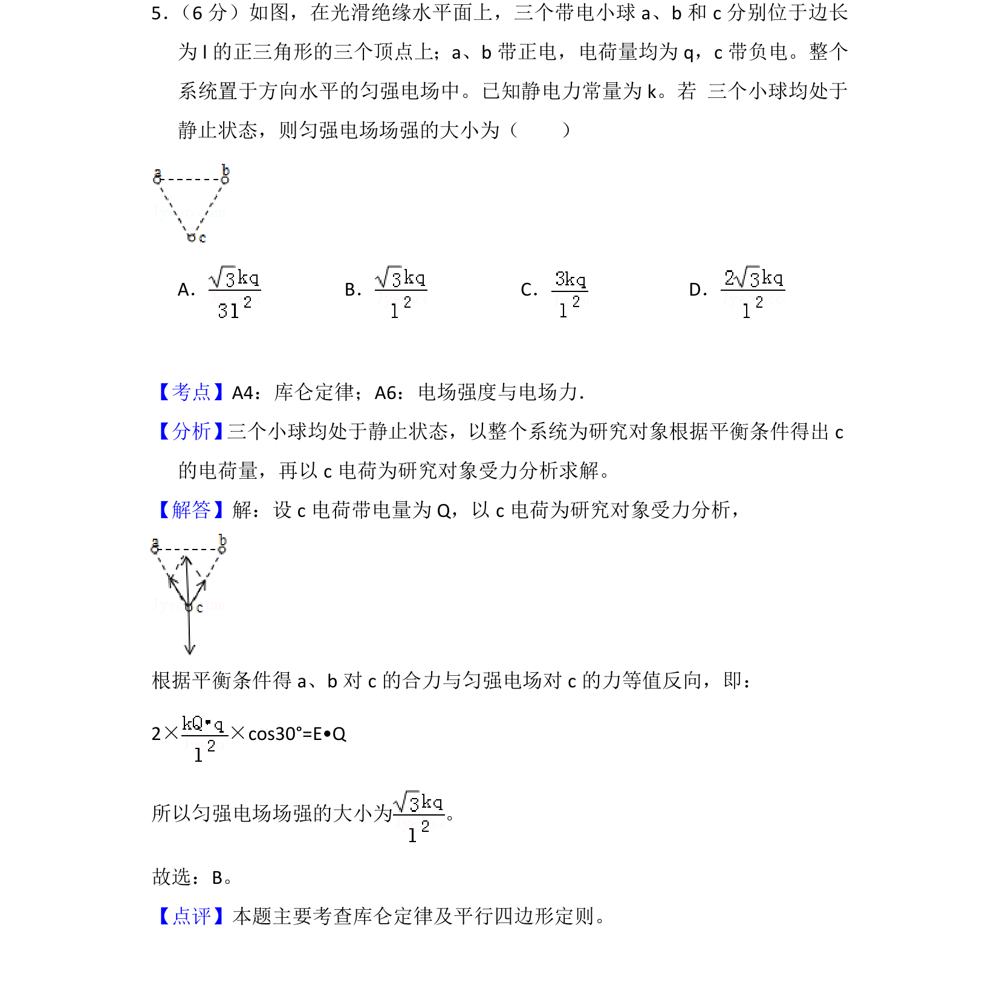
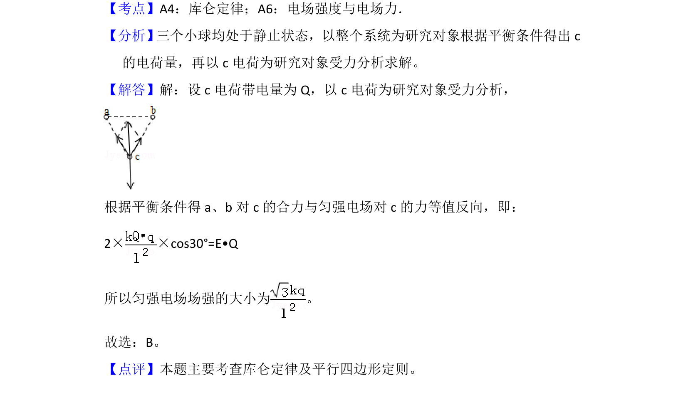

## 题面

## 摘要

三个点电荷在匀强电场中平衡，通过受力分析与库仑定律求解场强大小

## 关联考点

- [[263-库仑定律|库仑定律]]
- [[533-力的平衡|力的平衡]]
- [[701-矢量合成|矢量合成]]
- [[270-三角函数应用|三角函数]]

## 答案与解析

> 📄 原 PDF 第 5 页：`素材/真题/吉林/2008-2024·（吉林）物理高考真题/2013年高考物理试卷（新课标Ⅱ）（解析卷）.pdf`
