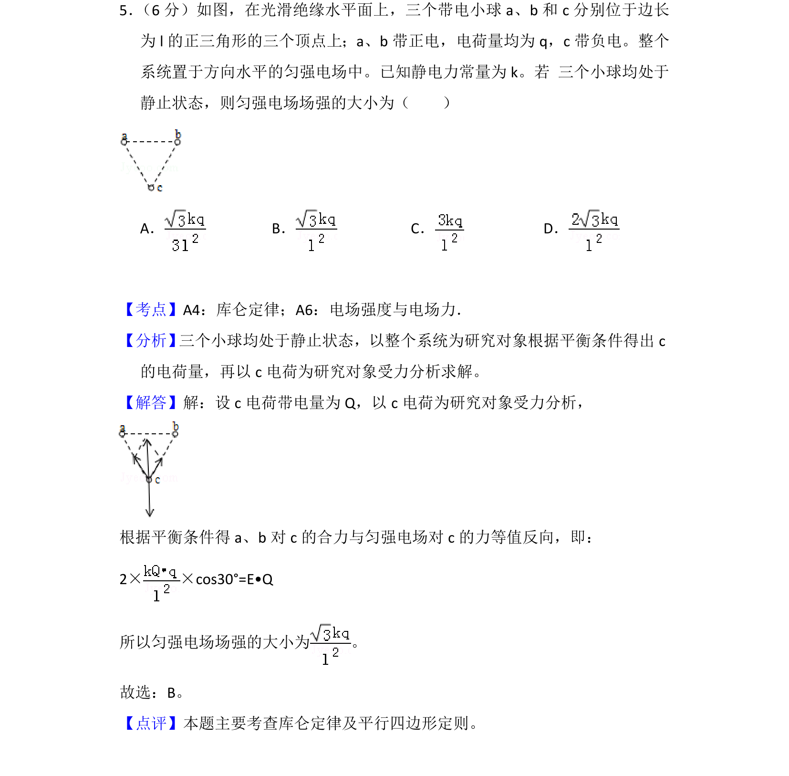
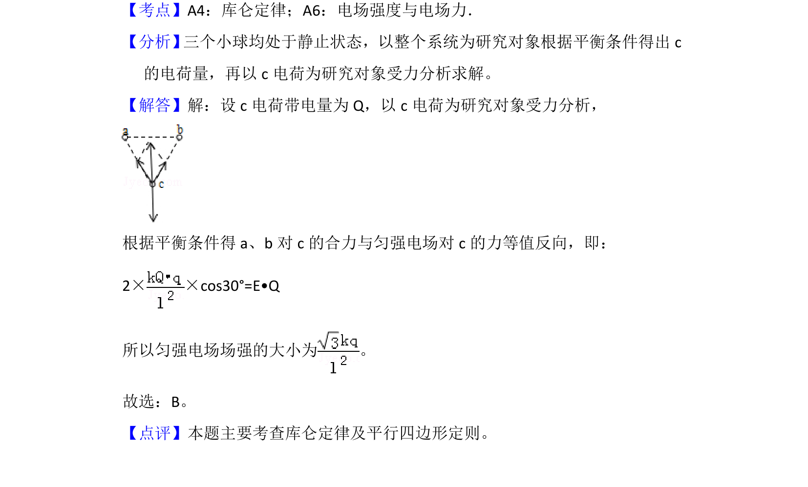

## 题面

## 摘要

三个点电荷在匀强电场中平衡，通过受力分析与库仑定律求解场强大小

## 关联考点

- [[263-库仑定律|库仑定律]]
- [[533-力的平衡|力的平衡]]
- [[701-矢量合成|矢量合成]]
- [[270-三角函数应用|三角函数]]

## 答案与解析

> 📄 原 PDF 第 5 页：`素材/真题/吉林/2008-2024·（吉林）物理高考真题/2013年高考物理试卷（新课标Ⅱ）（解析卷）.pdf`

<!-- 题干文本-start -->
## 题干文本
5． （6分）如图，在光滑绝缘水平面上，三个带电小球a、b和c分别位于边长
为l的正三角形的三个顶点上；a、b带正电，电荷量均为q，c带负电。整个
系统置于方向水平的匀强电场中。已知静电力常量为k。若 三个小球均处于
静止状态，则匀强电场场强的大小为（　　）
A．B．C．D．
<!-- 题干文本-end -->

<!-- 解析文本-start -->
## 解析文本
【考点】A4：库仑定律；A6：电场强度与电场力．菁优网版权所有
【分析】 三个小球均处于静止状态，以整个系统为研究对象根据平衡条件得出c
的电荷量，再以c电荷为研究对象受力分析求解。
【解答】解：设c电荷带电量为Q，以c电荷为研究对象受力分析，
根据平衡条件得a、b对c的合力与匀强电场对c的力等值反向，即：
2× ×cos30°=E•Q
所以匀强电场场强的大小为 。
故选：B。
【点评】本题主要考查库仑定律及平行四边形定则。
<!-- 解析文本-end -->
