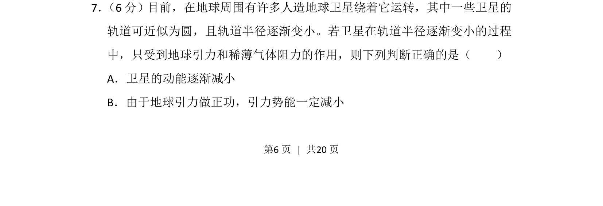
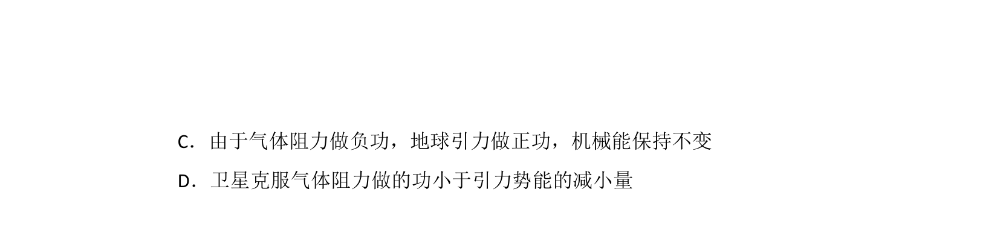
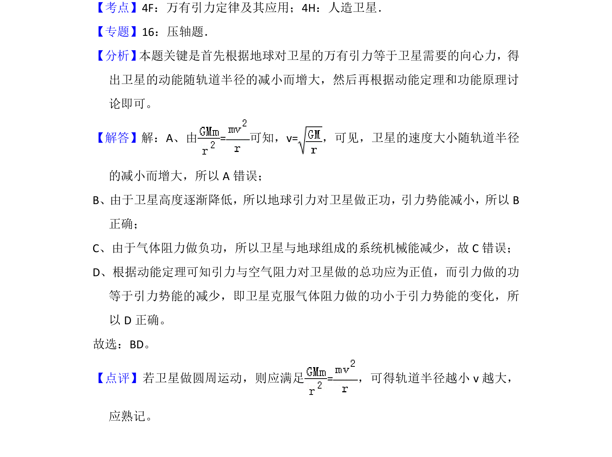

## 题面

## 摘要

卫星在稀薄气体阻力下轨道半径减小时，动能和引力势能的变化判断。

## 关联考点

- [[500-万有引力|万有引力]]
- [[548-卫星运动|卫星运动]]
- [[067-动能|动能]]
- [[470-引力势能|引力势能]]

## 答案与解析

> 📄 原 PDF 第 6 页：`素材/真题/吉林/2008-2024·（吉林）物理高考真题/2013年高考物理试卷（新课标Ⅱ）（解析卷）.pdf`

<!-- 题干文本-start -->
## 题干文本
7． （6分）目前，在地球周围有许多人造地球卫星绕着它运转，其中一些卫星的
轨道可近似为圆，且轨道半径逐渐变小。若卫星在轨道半径逐渐变小的过程
中，只受到地球引力和稀薄气体阻力的作用，则下列判断正确的是（　　）
A．卫星的动能逐渐减小
B．由于地球引力做正功，引力势能一定减小
<!-- 题干文本-end -->

<!-- 解析文本-start -->
## 解析文本

<!-- 解析文本-end -->
