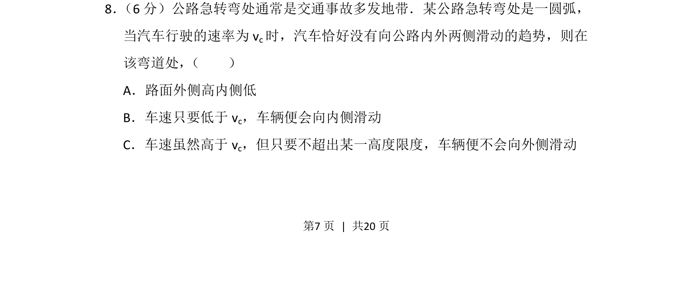
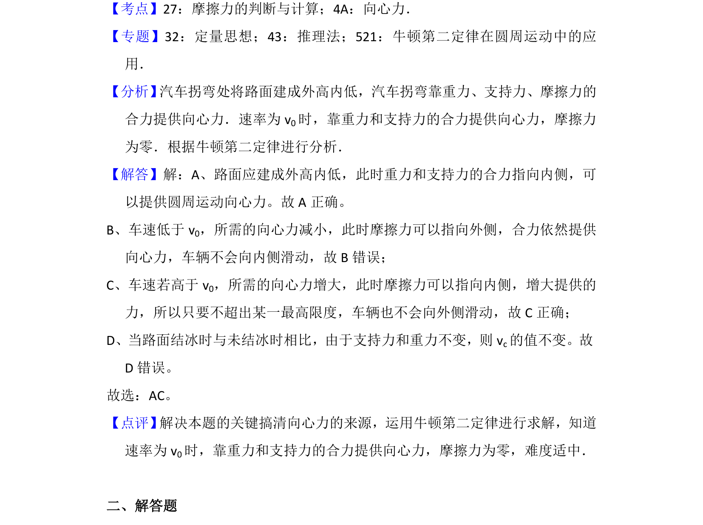

## 题面

## 摘要

该题考查汽车在圆弧弯道行驶时不侧滑的条件，涉及圆周运动向心力来源分析。

## 关联考点

- [[256-向心力|向心力]]
- [[081-摩擦力|摩擦力]]
- [[258-圆周运动|圆周运动]]

## 答案与解析

> 📄 原 PDF 第 7 页：`素材/真题/吉林/2008-2024·（吉林）物理高考真题/2013年高考物理试卷（新课标Ⅱ）（解析卷）.pdf`
