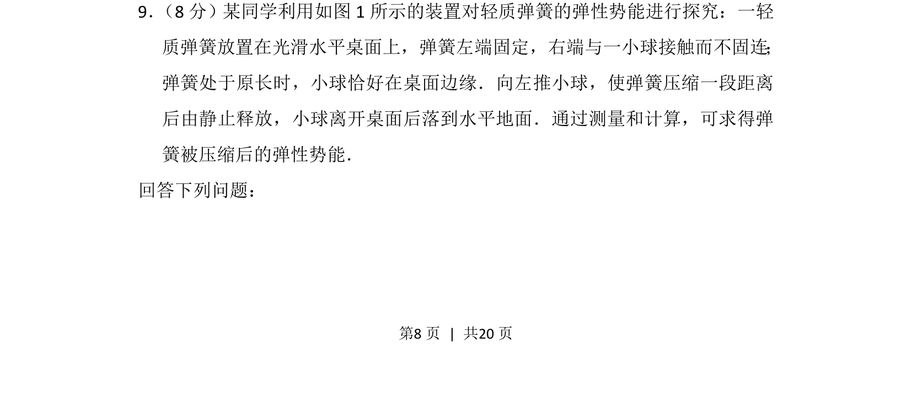

## 题面

## 摘要

通过弹簧释放小球做平抛运动测弹性势能，考查能量转化与平抛规律。

## 关联考点

- [[079-弹性势能|弹性势能]]
- [[261-平抛运动|平抛运动]]
- [[085-机械能守恒-初中|机械能守恒]]

## 答案与解析

> 📄 原 PDF 第 8 页：`素材/真题/吉林/2008-2024·（吉林）物理高考真题/2013年高考物理试卷（新课标Ⅱ）（解析卷）.pdf`
