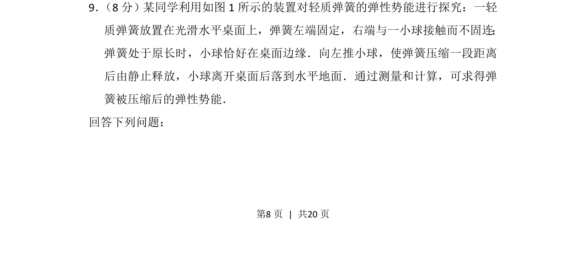
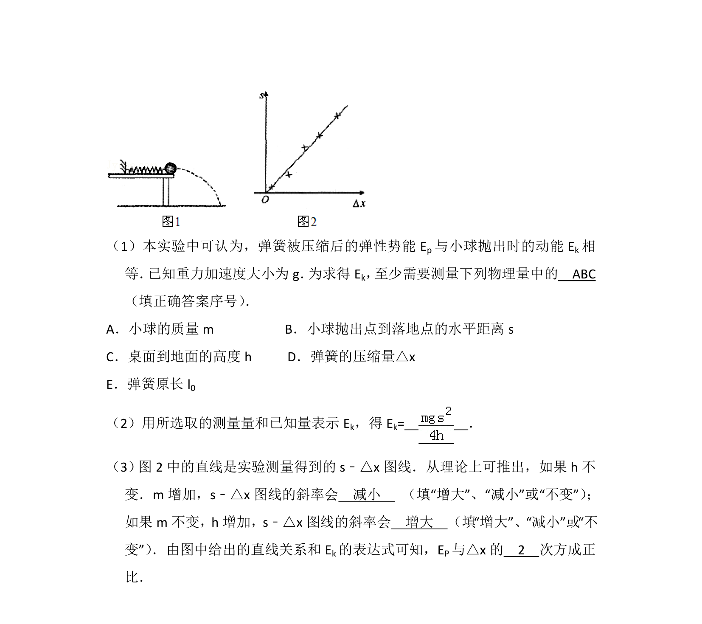
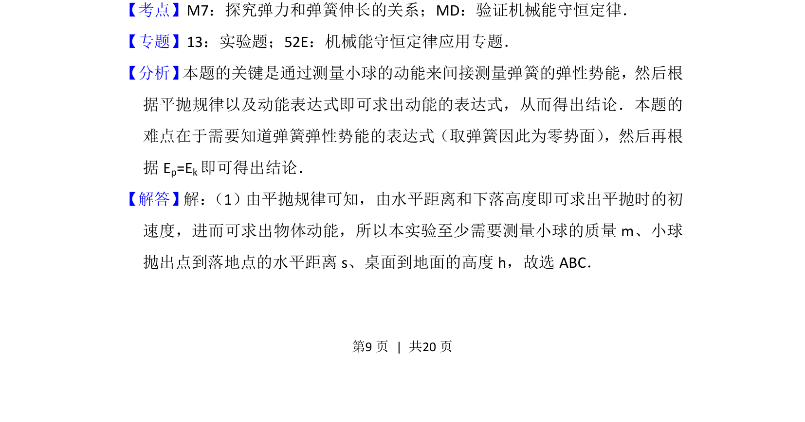
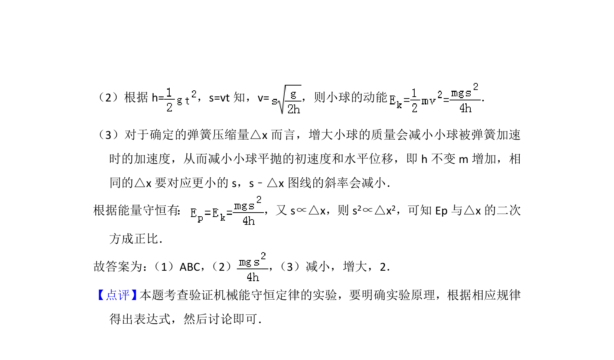

## 题面

## 摘要

通过弹簧释放小球做平抛运动测弹性势能，考查能量转化与平抛规律。

## 关联考点

- [[079-弹性势能|弹性势能]]
- [[261-平抛运动|平抛运动]]
- [[085-机械能守恒-初中|机械能守恒]]

## 答案与解析

> 📄 原 PDF 第 8 页：`素材/真题/吉林/2008-2024·（吉林）物理高考真题/2013年高考物理试卷（新课标Ⅱ）（解析卷）.pdf`

<!-- 题干文本-start -->
## 题干文本
9． （8分）某同学利用如图1所示的装置对轻质弹簧的弹性势能进行探究：一轻
质弹簧放置在光滑水平桌面上，弹簧左端固定，右端与一小球接触而不固连；
弹簧处于原长时，小球恰好在桌面边缘．向左推小球，使弹簧压缩一段距离
后由静止释放，小球离开桌面后落到水平地面．通过测量和计算，可求得弹
簧被压缩后的弹性势能．
回答下列问题：
<!-- 题干文本-end -->

<!-- 解析文本-start -->
## 解析文本

<!-- 解析文本-end -->
