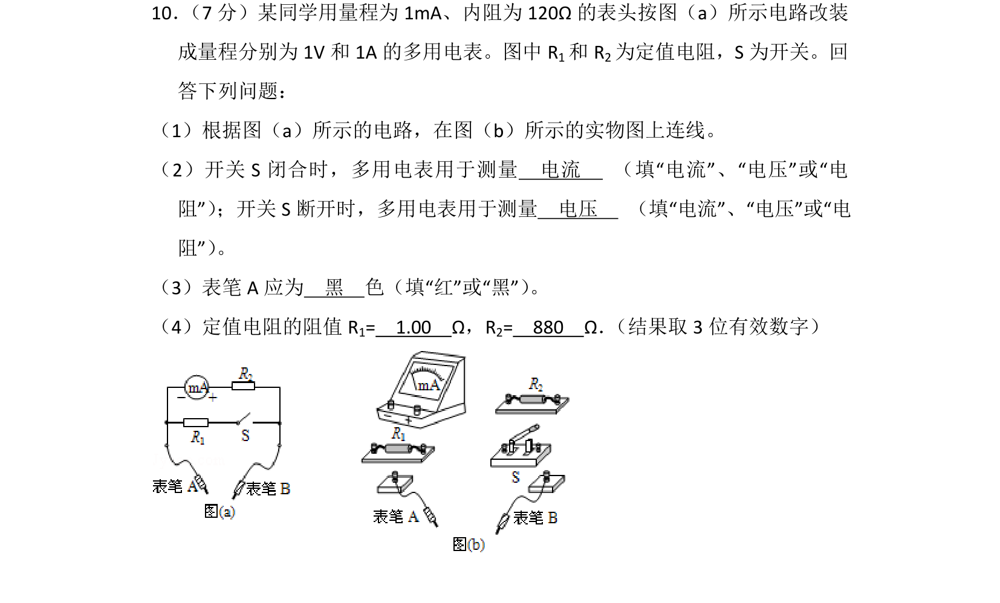
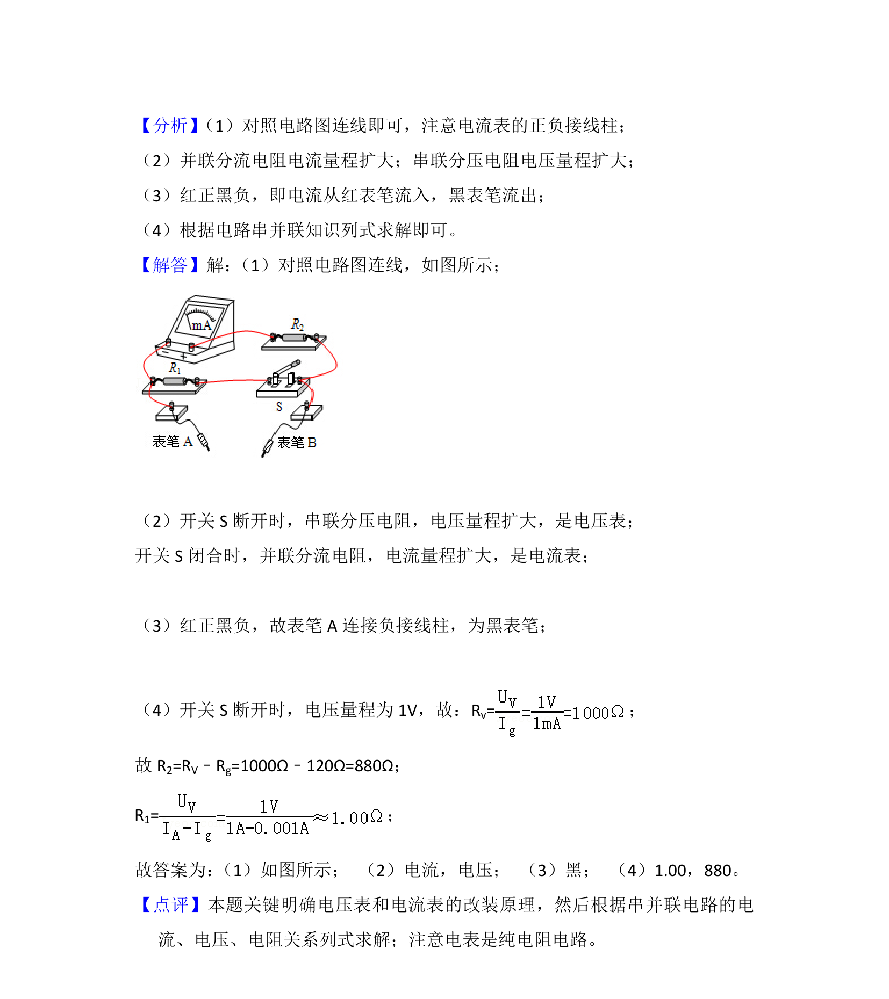

## 题面

## 摘要

考查多用电表改装原理，包括实物连线、功能判断和定值电阻计算。

## 关联考点

- [[684-电流表改装|电流表改装]]
- [[332-闭合电路欧姆定律|闭合电路欧姆定律]]
- [[505-串并联电路计算|串并联电路计算]]

## 答案与解析

> 📄 原 PDF 第 10 页：`素材/真题/吉林/2008-2024·（吉林）物理高考真题/2013年高考物理试卷（新课标Ⅱ）（解析卷）.pdf`
