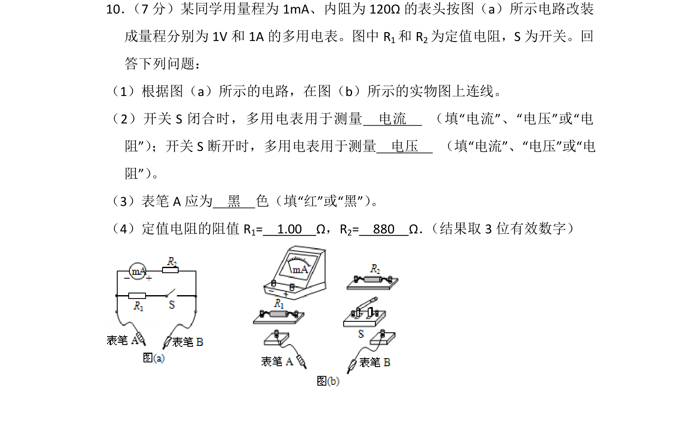
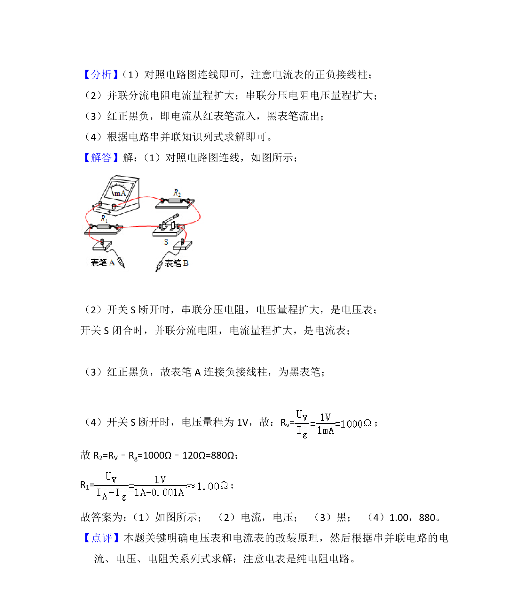

## 题面

## 摘要

考查多用电表改装原理，包括实物连线、功能判断和定值电阻计算。

## 关联考点

- [[683-电流表改装|电流表改装]]
- [[332-闭合电路欧姆定律|闭合电路欧姆定律]]
- [[505-串并联电路计算|串并联电路计算]]

## 答案与解析

> 📄 原 PDF 第 10 页：`素材/真题/吉林/2008-2024·（吉林）物理高考真题/2013年高考物理试卷（新课标Ⅱ）（解析卷）.pdf`

<!-- 题干文本-start -->
## 题干文本
10． （7分）某同学用量程为1mA、内阻为120Ω的表头按图（a）所示电路改装
成量程分别为1V和1A的多用电表。图中R 1和R 2为定值电阻，S为开关。回
答下列问题：
（1）根据图（a）所示的电路，在图（b）所示的实物图上连线。
（2）开关S闭合时，多用电表用于测量　电流　 （填“电流”、“电压”或“电
阻”） ；开关S断开时，多用电表用于测量　电压　 （填“电流”、“电压”或“电
阻”） 。
（3）表笔A应为　黑　色（填“红”或“黑”） 。
（4）定值电阻的阻值R 1=　1.00　Ω，R2=　880　Ω． （结果取3位有效数字）
<!-- 题干文本-end -->

<!-- 解析文本-start -->
## 解析文本
【考点】NA：把电流表改装成电压表．菁优网版权所有
【专题】13：实验题；535：恒定电流专题．
<!-- 解析文本-end -->
