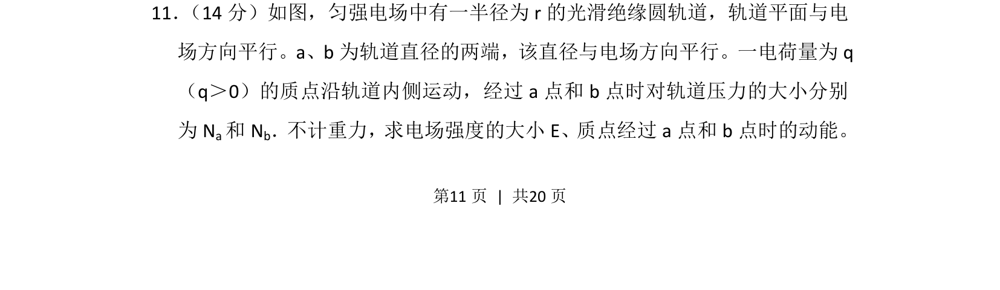
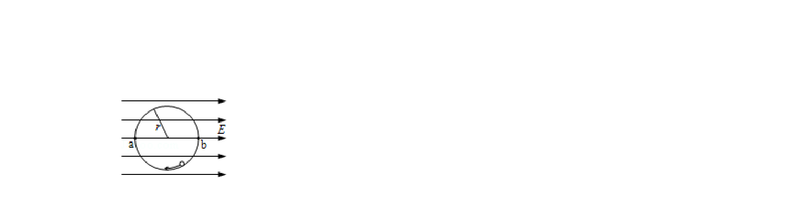
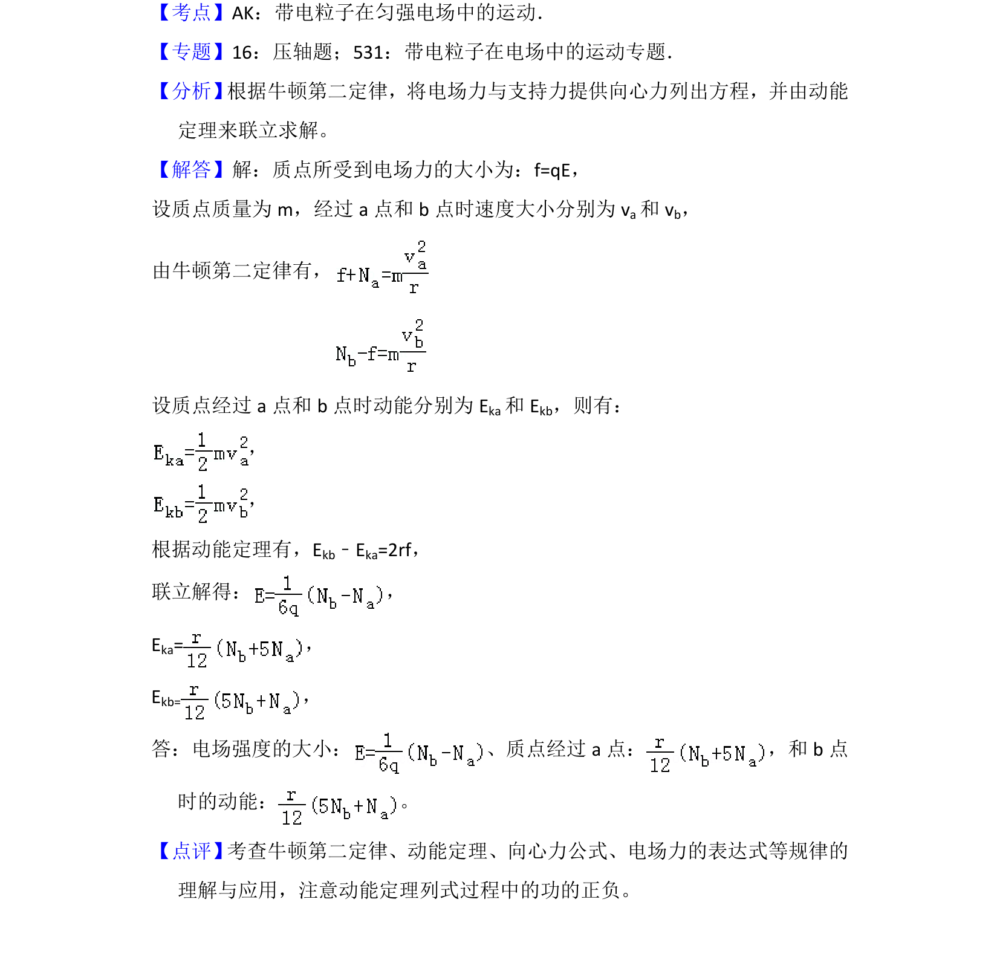

## 题面

## 摘要

一电荷在匀强电场的光滑绝缘圆轨道运动，结合向心力公式和动能定理求场强及动能

## 关联考点

- [[229-牛顿第二定律|牛顿第二定律]]
- [[251-动能定理|动能定理]]
- [[561-向心力公式|向心力公式]]
- [[672-电场力|电场力]]

## 答案与解析

> 📄 原 PDF 第 11 页：`素材/真题/吉林/2008-2024·（吉林）物理高考真题/2013年高考物理试卷（新课标Ⅱ）（解析卷）.pdf`
