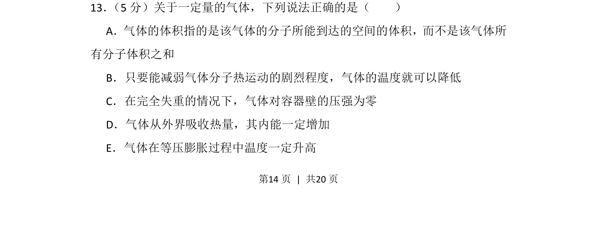
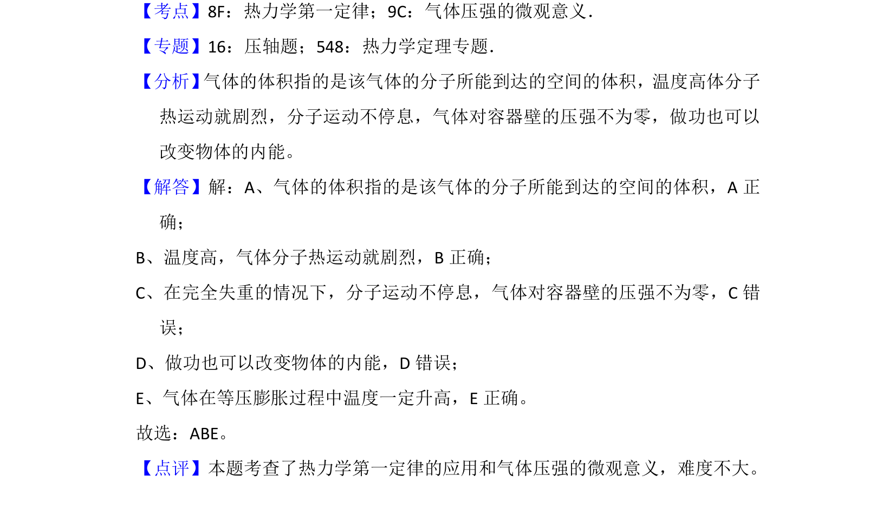

## 题面

## 摘要

本题考查气体分子动理论及热力学第一定律，辨析气体体积、温度、压强、内能等概念。

## 关联考点

- [[气体分子动理论]]
- [[440-热力学第一定律|热力学第一定律]]
- [[446-理想气体状态方程|理想气体状态方程]]

## 答案与解析

> 📄 原 PDF 第 14 页：`素材/真题/吉林/2008-2024·（吉林）物理高考真题/2013年高考物理试卷（新课标Ⅱ）（解析卷）.pdf`
