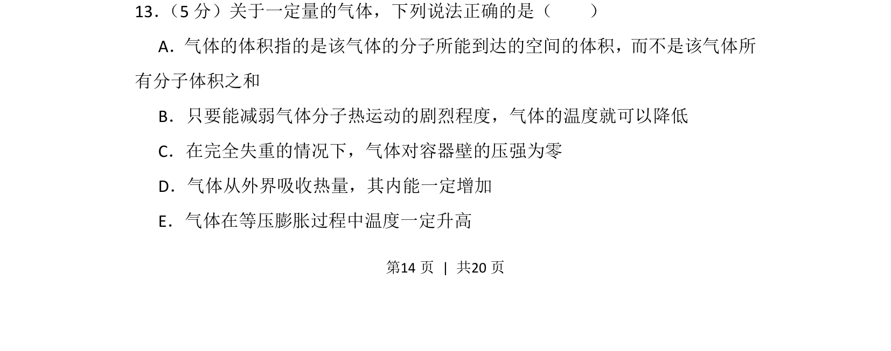
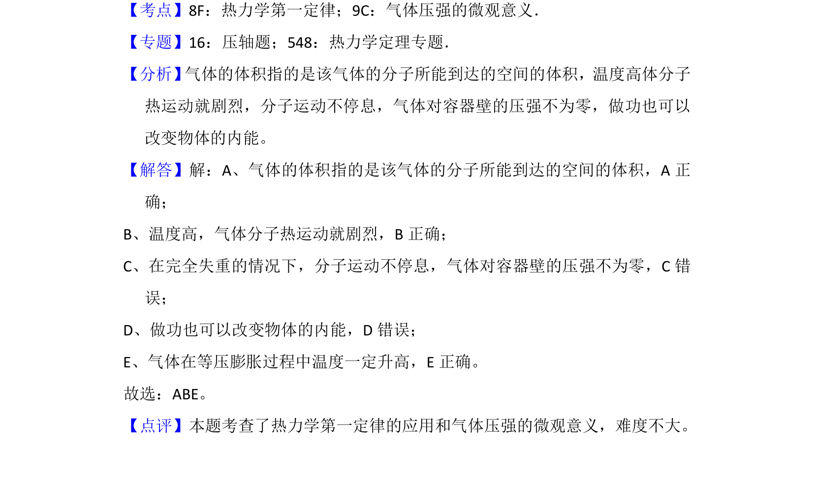

## 题面

## 摘要

该题考查气体体积的微观含义、温度与分子热运动、气体压强产生条件、热力学第一定律及等压膨胀中的温度变化。

## 关联考点

- [[476-气体体积微观含义|气体体积微观含义]]
- [[654-温度与分子平均动能|温度与分子平均动能]]
- [[432-气体压强微观解释|气体压强微观解释]]
- [[440-热力学第一定律|热力学第一定律]]
- [[447-盖吕萨克定律|盖-吕萨克定律]]

## 答案与解析

> 📄 原 PDF 第 14 页：`素材/真题/吉林/2008-2024·（吉林）物理高考真题/2013年高考物理试卷（新课标Ⅱ）（解析卷）.pdf`

<!-- 题干文本-start -->
## 题干文本
13． （5分）关于一定量的气体，下列说法正确的是（　　）
A．气体的体积指的是该气体的分子所能到达的空间的体积，而不是该气体所
有分子体积之和
B．只要能减弱气体分子热运动的剧烈程度，气体的温度就可以降低
C．在完全失重的情况下，气体对容器壁的压强为零
D．气体从外界吸收热量，其内能一定增加
E．气体在等压膨胀过程中温度一定升高
<!-- 题干文本-end -->

<!-- 解析文本-start -->
## 解析文本

<!-- 解析文本-end -->
