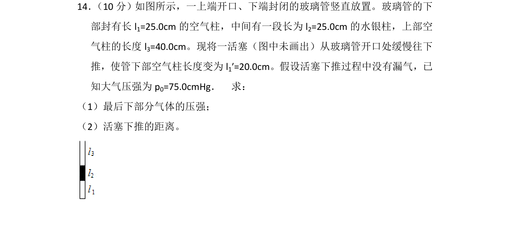
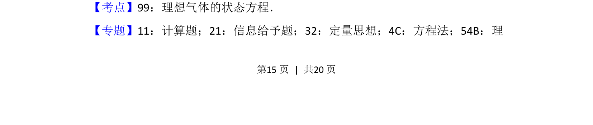
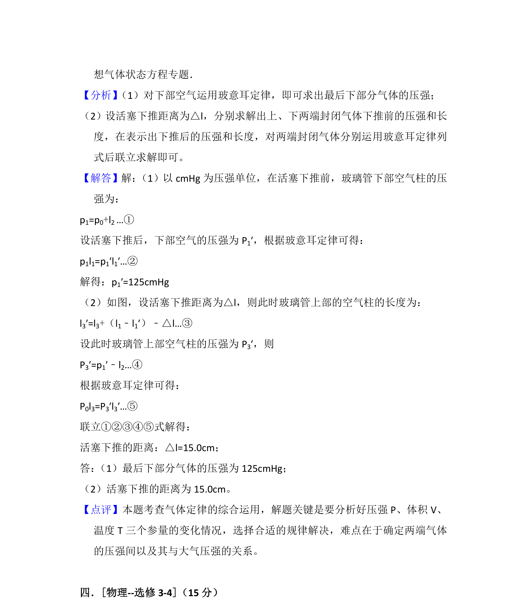

## 题面

## 摘要

本题考查理想气体状态方程的应用，通过活塞下推过程分析气体压强和体积变化。

## 关联考点

- [[446-理想气体状态方程|理想气体的状态方程]]
- [[550-压强计算|压强计算]]
- [[444-玻意耳定律|等温变化]]

## 答案与解析

> 📄 原 PDF 第 15 页：`素材/真题/吉林/2008-2024·（吉林）物理高考真题/2013年高考物理试卷（新课标Ⅱ）（解析卷）.pdf`

<!-- 题干文本-start -->
## 题干文本
14． （10分）如图所示，一上端开口、下端封闭的玻璃管竖直放置。玻璃管的下
部封有长l 1=25.0cm的空气柱，中间有一段长为l 2=25.0cm的水银柱，上部空
气柱的长度l 3=40.0cm。现将一活塞（图中未画出）从玻璃管开口处缓慢往下
推，使管下部空气柱长度变为l 1′=20.0cm。假设活塞下推过程中没有漏气，已
知大气压强为p 0=75.0cmHg．　求：
（1）最后下部分气体的压强；
（2）活塞下推的距离。
<!-- 题干文本-end -->

<!-- 解析文本-start -->
## 解析文本
【考点】99：理想气体的状态方程．菁优网版权所有
【专题】11：计算题；21：信息给予题；32：定量思想；4C：方程法；54B：理
<!-- 解析文本-end -->
