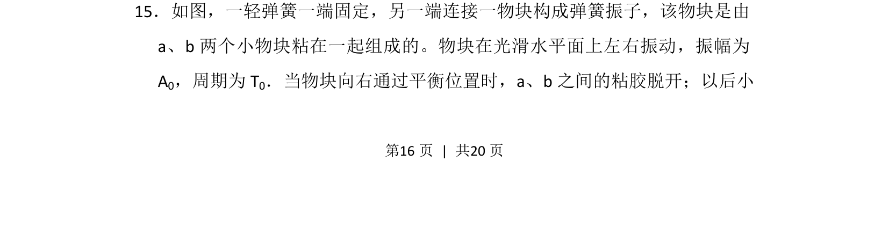
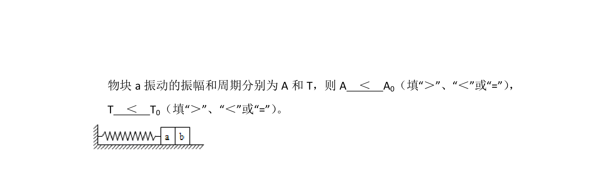
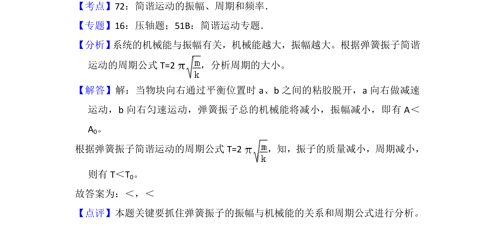

## 题面

## 摘要

本题考查弹簧振子模型中物块分离前后的周期和振幅变化分析。

## 关联考点

- [[712-简谐振动|简谐振动]]
- [[261-周期|周期]]
- [[361-振幅|振幅]]

## 答案与解析

> 📄 原 PDF 第 16 页：`素材/真题/吉林/2008-2024·（吉林）物理高考真题/2013年高考物理试卷（新课标Ⅱ）（解析卷）.pdf`

<!-- 题干文本-start -->
## 题干文本
15．如图，一轻弹簧一端固定，另一端连接一物块构成弹簧振子，该物块是由
a、b两个小物块粘在一起组成的。物块在光滑水平面上左右振动，振幅为
A0，周期为T 0．当物块向右通过平衡位置时，a、b之间的粘胶脱开；以后小
<!-- 题干文本-end -->

<!-- 解析文本-start -->
## 解析文本

<!-- 解析文本-end -->
