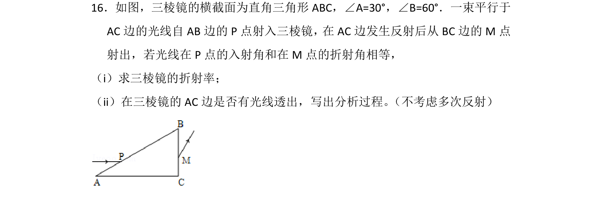
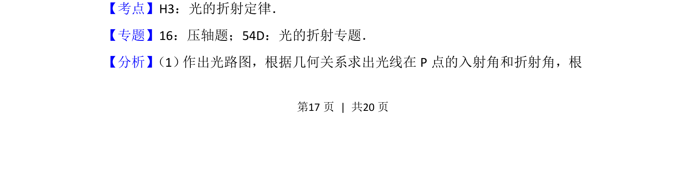
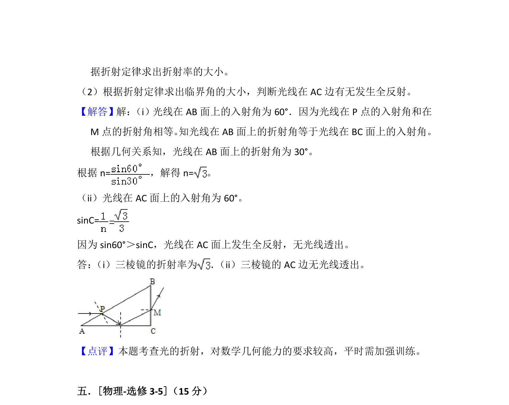

## 题面

## 摘要

考查光的折射定律及几何光学，结合反射与折射求折射率并分析全反射条件。

## 关联考点

- [[026-折射定律|折射定律]]
- [[343-全反射|全反射]]
- [[456-几何关系|几何关系]]

## 答案与解析

> 📄 原 PDF 第 17 页：`素材/真题/吉林/2008-2024·（吉林）物理高考真题/2013年高考物理试卷（新课标Ⅱ）（解析卷）.pdf`

<!-- 题干文本-start -->
## 题干文本
16．如图，三棱镜的横截面为直角三角形ABC，∠A=30°，∠B=60°．一束平行于
AC边的光线自AB边的P点射入三棱镜，在AC边发生反射后从BC边的M点
射出，若光线在P点的入射角和在M点的折射角相等，
（i）求三棱镜的折射率；
（ii）在三棱镜的AC边是否有光线透出，写出分析过程。 （不考虑多次反射）
<!-- 题干文本-end -->

<!-- 解析文本-start -->
## 解析文本
【考点】H3：光的折射定律．菁优网版权所有
【专题】16：压轴题；54D：光的折射专题．
【分析】 （1） 作出光路图，根据几何关系求出光线在P点的入射角和折射角，根
<!-- 解析文本-end -->
