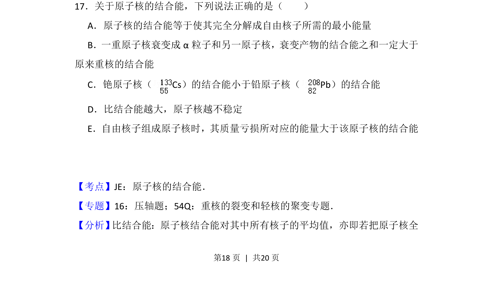
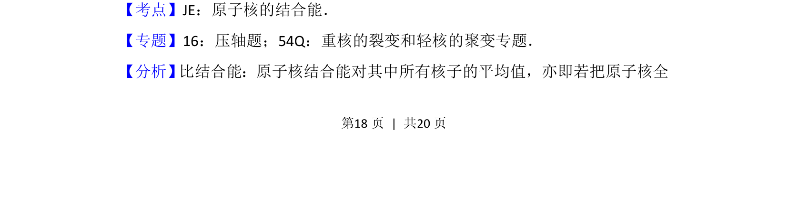
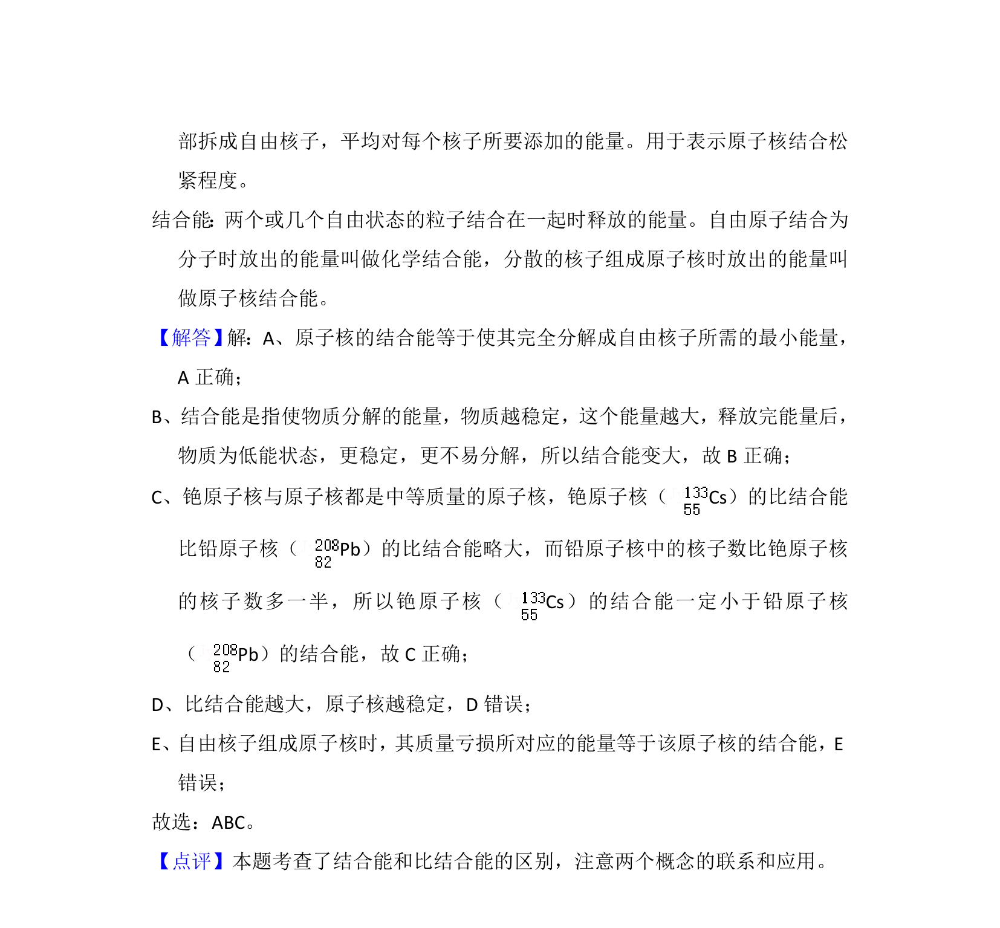

## 题面

## 摘要

本题通过多项选择形式考查原子核结合能的概念、比结合能与稳定性的关系及质量亏损相关计算。

## 关联考点

- [[551-原子核的结合能|原子核的结合能]]
- [[633-比结合能|比结合能]]
- [[449-质能方程|质量亏损]]

## 答案与解析

> 📄 原 PDF 第 18 页：`素材/真题/吉林/2008-2024·（吉林）物理高考真题/2013年高考物理试卷（新课标Ⅱ）（解析卷）.pdf`

<!-- 题干文本-start -->
## 题干文本
17．关于原子核的结合能，下列说法正确的是（　　）
A．原子核的结合能等于使其完全分解成自由核子所需的最小能量
B．一重原子核衰变成α粒子和另一原子核，衰变产物的结合能之和一定大于
原来重核的结合能
C．铯原子核（Cs）的结合能小于铅原子核（Pb）的结合能
D．比结合能越大，原子核越不稳定
E．自由核子组成原子核时，其质量亏损所对应的能量大于该原子核的结合能
<!-- 题干文本-end -->

<!-- 解析文本-start -->
## 解析文本
【考点】JE：原子核的结合能．菁优网版权所有
【专题】16：压轴题；54Q：重核的裂变和轻核的聚变专题．
【分析】 比结合能：原子核结合能对其中所有核子的平均值，亦即若把原子核全
<!-- 解析文本-end -->
