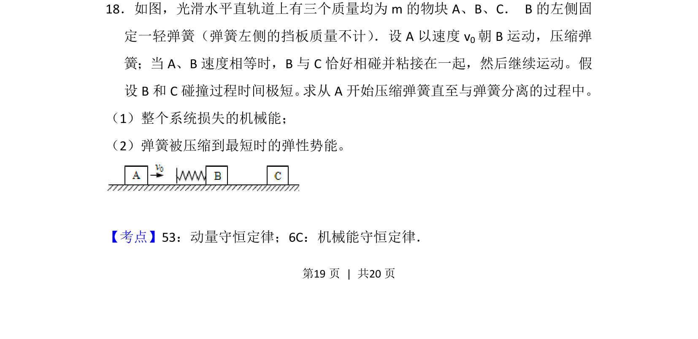

## 题面

## 摘要

本题通过弹簧连接体碰撞模型，综合考查动量守恒定律和机械能守恒定律的应用。

## 关联考点

- [[347-动量守恒定律|动量守恒定律]]
- [[085-机械能守恒-初中|机械能守恒定律]]

## 答案与解析

> 📄 原 PDF 第 19 页：`素材/真题/吉林/2008-2024·（吉林）物理高考真题/2013年高考物理试卷（新课标Ⅱ）（解析卷）.pdf`
