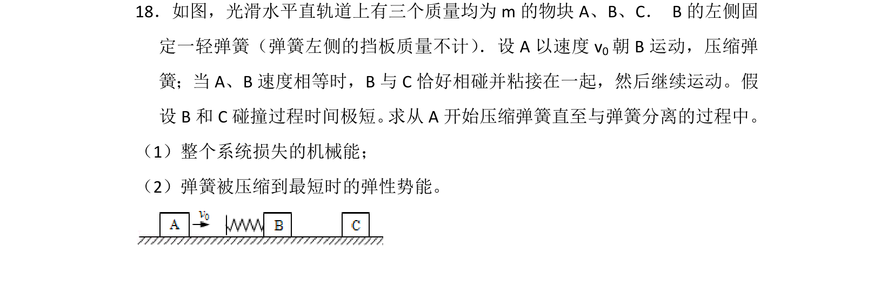
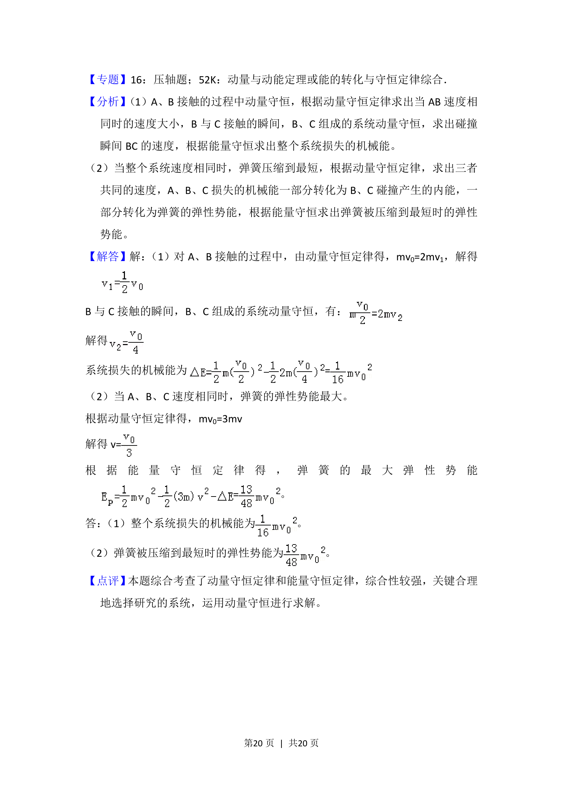

## 题面

## 摘要

本题通过弹簧连接体碰撞模型，综合考查动量守恒定律和机械能守恒定律的应用。

## 关联考点

- [[347-动量守恒定律|动量守恒定律]]
- [[085-机械能守恒-初中|机械能守恒定律]]

## 答案与解析

> 📄 原 PDF 第 19 页：`素材/真题/吉林/2008-2024·（吉林）物理高考真题/2013年高考物理试卷（新课标Ⅱ）（解析卷）.pdf`

<!-- 题干文本-start -->
## 题干文本
18．如图，光滑水平直轨道上有三个质量均为m的物块A、B、C． B的左侧固
定一轻弹簧（弹簧左侧的挡板质量不计） ．设A以速度v 0朝B运动，压缩弹
簧；当A、B速度相等时，B与C恰好相碰并粘接在一起，然后继续运动。假
设B和C碰撞过程时间极短。 求从A开始压缩弹簧直至与弹簧分离的过程中。
（1）整个系统损失的机械能；
（2）弹簧被压缩到最短时的弹性势能。
<!-- 题干文本-end -->

<!-- 解析文本-start -->
## 解析文本
【考点】53：动量守恒定律；6C：机械能守恒定律．菁优网版权所有
<!-- 解析文本-end -->
