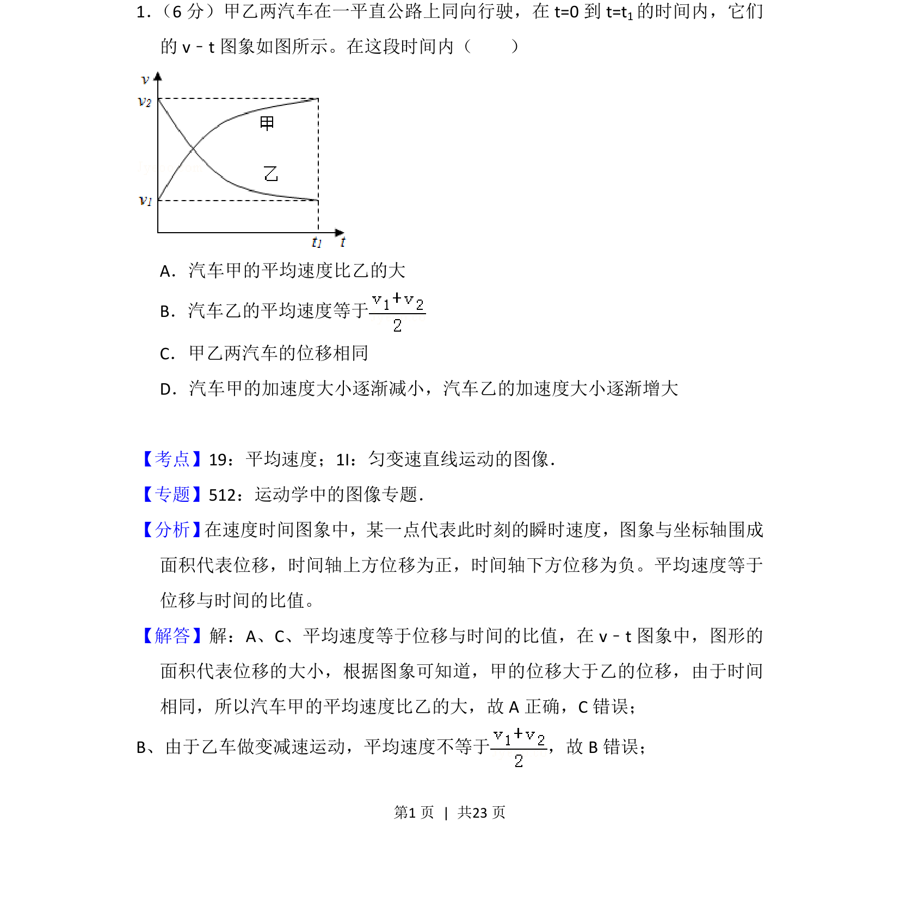
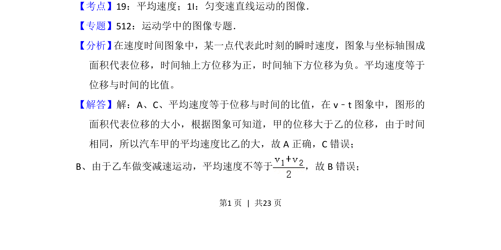
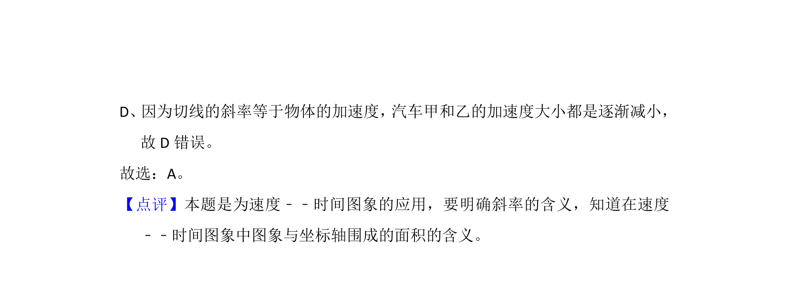

## 题面

## 摘要

本题通过v-t图像分析两车的平均速度、位移和加速度变化规律。

## 关联考点

- [[023-平均速度|平均速度]]
- [[v-t图像]]
- [[203-位移-矢量|位移]]
- [[214-加速度|加速度]]

## 答案与解析

> 📄 原 PDF 第 1 页：`素材/真题/吉林/2008-2024·（吉林）物理高考真题/2014年高考物理试卷（新课标Ⅱ）（解析卷）.pdf`
