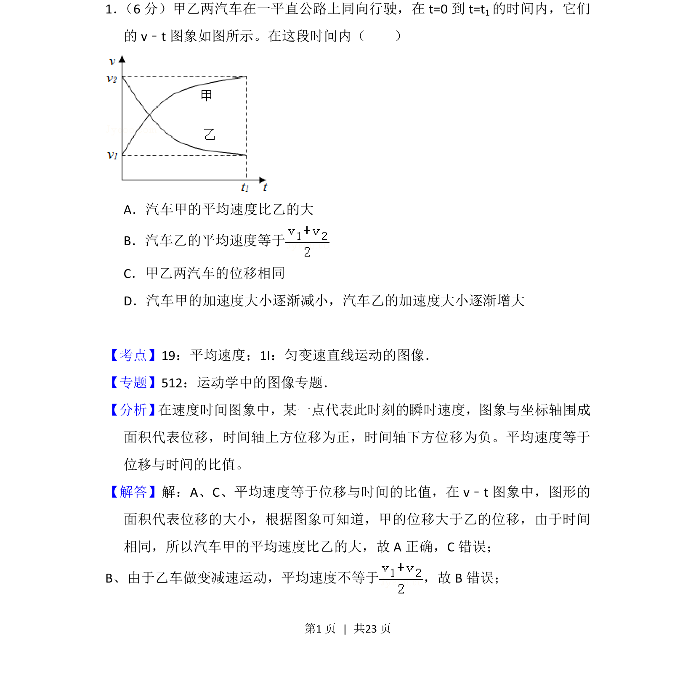
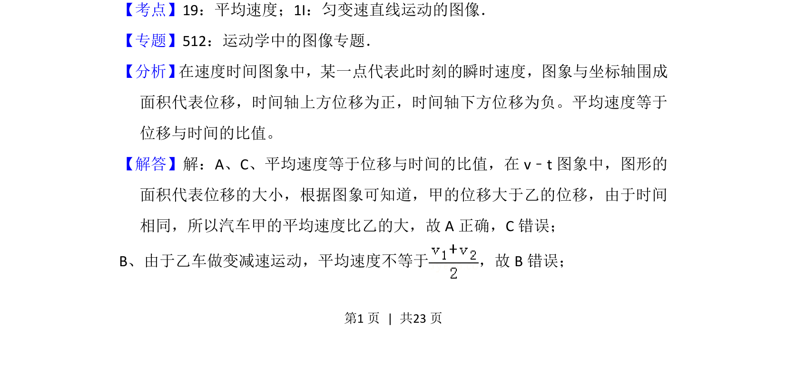
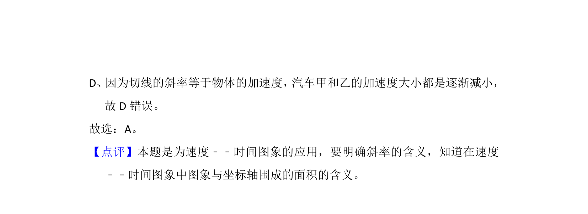

## 题面

## 摘要

本题通过v-t图像分析两车的平均速度、位移和加速度变化规律。

## 关联考点

- [[023-平均速度|平均速度]]
- [[497-v-t图像|v-t图像]]
- [[203-位移-矢量|位移]]
- [[214-加速度|加速度]]

## 答案与解析

> 📄 原 PDF 第 1 页：`素材/真题/吉林/2008-2024·（吉林）物理高考真题/2014年高考物理试卷（新课标Ⅱ）（解析卷）.pdf`

<!-- 题干文本-start -->
## 题干文本
1． （6分）甲乙两汽车在一平直公路上同向行驶，在t=0到t=t1的时间内，它们
的v﹣t图象如图所示。在这段时间内（　　）
A．汽车甲的平均速度比乙的大
B．汽车乙的平均速度等于
C．甲乙两汽车的位移相同
D．汽车甲的加速度大小逐渐减小，汽车乙的加速度大小逐渐增大
<!-- 题干文本-end -->

<!-- 解析文本-start -->
## 解析文本
【考点】19：平均速度；1I：匀变速直线运动的图像．菁优网版权所有
【专题】512：运动学中的图像专题．
【分析】 在速度时间图象中，某一点代表此时刻的瞬时速度，图象与坐标轴围成
面积代表位移，时间轴上方位移为正，时间轴下方位移为负。平均速度等于
位移与时间的比值。
【解答】解：A、C、平均速度等于位移与时间的比值，在v﹣t图象中，图形的
面积代表位移的大小，根据图象可知道，甲的位移大于乙的位移，由于时间
相同，所以汽车甲的平均速度比乙的大，故A正确，C错误；
B、由于乙车做变减速运动，平均速度不等于 ，故B错误；
<!-- 解析文本-end -->
