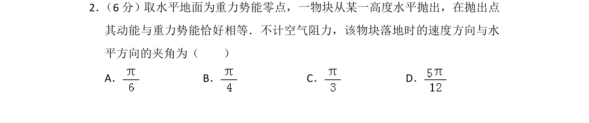
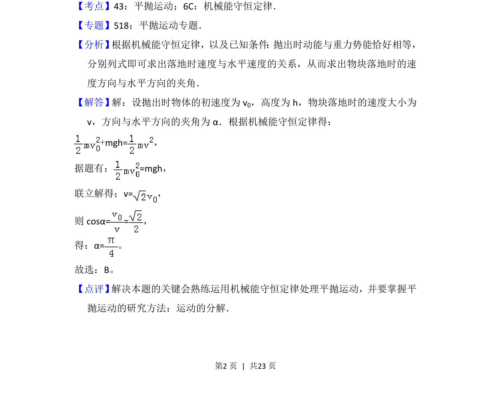

## 题面

## 摘要

一物块水平抛出时动能与重力势能相等，根据机械能守恒求落地速度方向与水平方向的夹角。

## 关联考点

- [[261-平抛运动|平抛运动]]
- [[085-机械能守恒-初中|机械能守恒定律]]

## 答案与解析

> 📄 原 PDF 第 2 页：`素材/真题/吉林/2008-2024·（吉林）物理高考真题/2014年高考物理试卷（新课标Ⅱ）（解析卷）.pdf`
