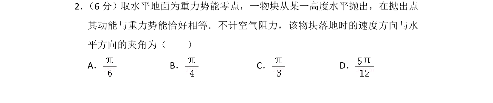
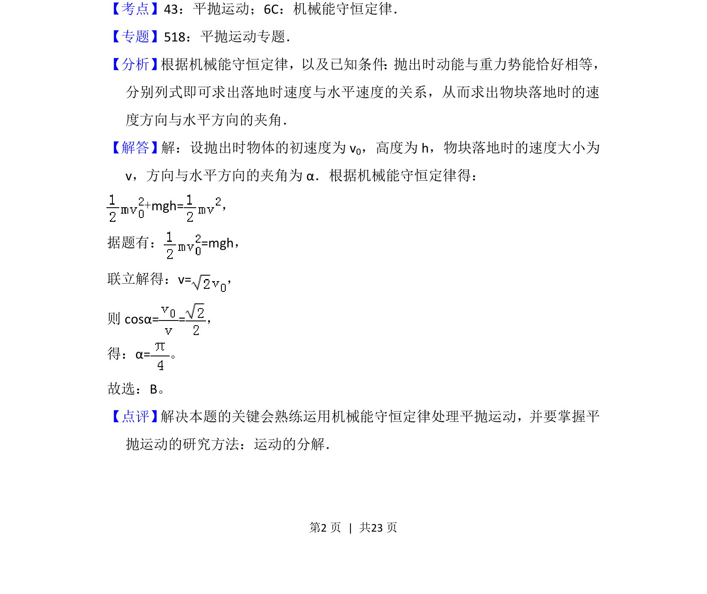

## 题面

## 摘要

一物块水平抛出时动能与重力势能相等，根据机械能守恒求落地速度方向与水平方向的夹角。

## 关联考点

- [[261-平抛运动|平抛运动]]
- [[085-机械能守恒-初中|机械能守恒定律]]

## 答案与解析

> 📄 原 PDF 第 2 页：`素材/真题/吉林/2008-2024·（吉林）物理高考真题/2014年高考物理试卷（新课标Ⅱ）（解析卷）.pdf`

<!-- 题干文本-start -->
## 题干文本
2． （6分）取水平地面为重力势能零点，一物块从某一高度水平抛出，在抛出点
其动能与重力势能恰好相等．不计空气阻力，该物块落地时的速度方向与水
平方向的夹角为（　　）
A．B．C．D．
<!-- 题干文本-end -->

<!-- 解析文本-start -->
## 解析文本
【考点】43：平抛运动；6C：机械能守恒定律．菁优网版权所有
【专题】518：平抛运动专题．
【分析】 根据机械能守恒定律，以及已知条件 ： 抛出时动能与重力势能恰好相等，
分别列式即可求出落地时速度与水平速度的关系，从而求出物块落地时的速
度方向与水平方向的夹角．
【解答】解：设抛出时物体的初速度为v0，高度为h，物块落地时的速度大小为
v，方向与水平方向的夹角为α．根据机械能守恒定律得：
+mgh=，
据题有：=mgh，
联立解得：v=，
则cosα==，
得：α=。
故选：B。
【点评】 解决本题的关键会熟练运用机械能守恒定律处理平抛运动，并要掌握平
抛运动的研究方法：运动的分解．
<!-- 解析文本-end -->
