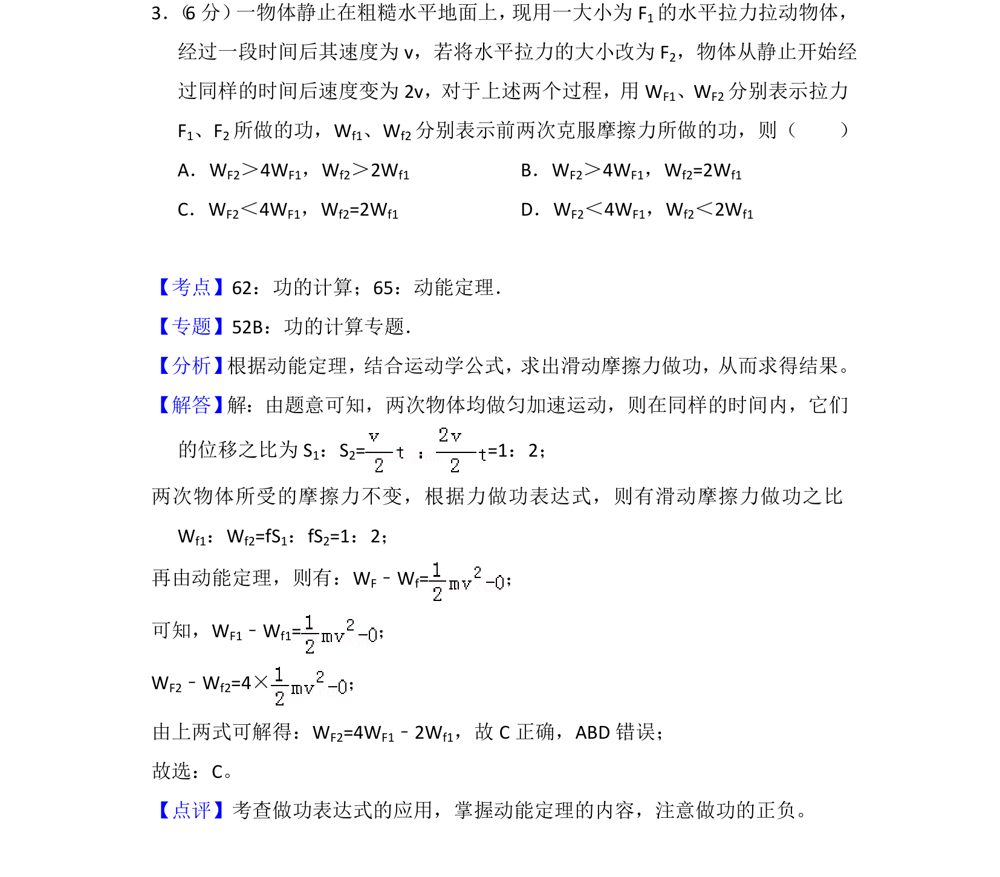
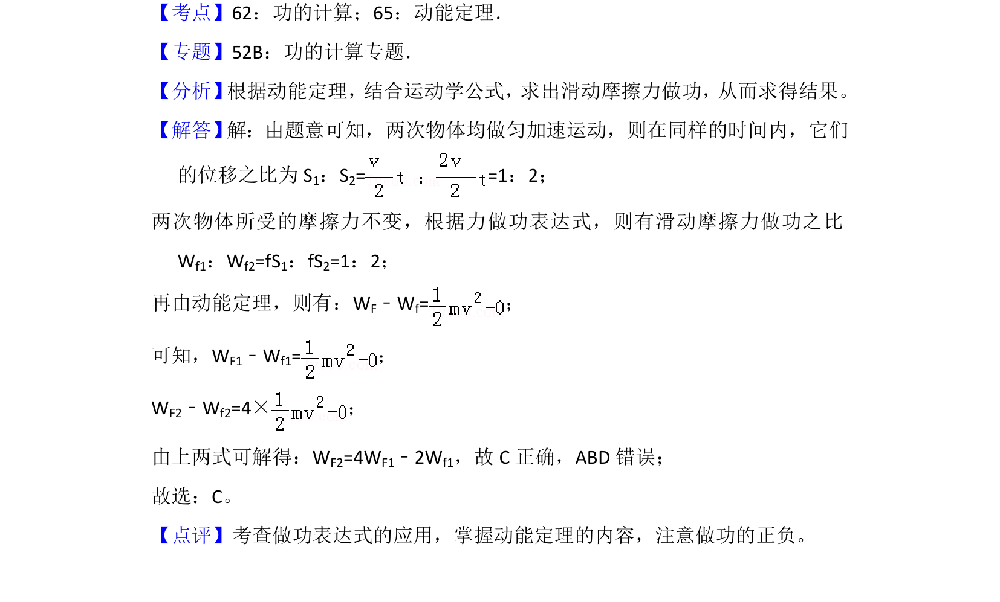

## 题面

## 摘要

考查动能定理与功的计算，比较不同拉力下做功与克服摩擦力做功的关系。

## 关联考点

- [[754-功的计算|功的计算]]
- [[251-动能定理|动能定理]]

## 答案与解析

> 📄 原 PDF 第 3 页：`素材/真题/吉林/2008-2024·（吉林）物理高考真题/2014年高考物理试卷（新课标Ⅱ）（解析卷）.pdf`

<!-- 题干文本-start -->
## 题干文本
3． （6分） 一物体静止在粗糙水平地面上， 现用一大小为F1的水平拉力拉动物体，
经过一段时间后其速度为v，若将水平拉力的大小改为F 2，物体从静止开始经
过同样的时间后速度变为2v，对于上述两个过程，用W F1、WF2分别表示拉力
F1、F2所做的功，Wf1、Wf2分别表示前两次克服摩擦力所做的功，则（　　）
A．WF2＞4WF1，Wf2＞2Wf1 B．WF2＞4WF1，Wf2=2Wf1
C．WF2＜4WF1，Wf2=2Wf1 D．WF2＜4WF1，Wf2＜2Wf1
<!-- 题干文本-end -->

<!-- 解析文本-start -->
## 解析文本
【考点】62：功的计算；65：动能定理．菁优网版权所有
【专题】52B：功的计算专题．
【分析】 根据动能定理，结合运动学公式，求出滑动摩擦力做功，从而求得结果。
【解答】 解：由题意可知，两次物体均做匀加速运动，则在同样的时间内，它们
的位移之比为S 1：S2= =1：2；
两次物体所受的摩擦力不变，根据力做功表达式，则有滑动摩擦力做功之比
Wf1：Wf2=fS1：fS2=1：2；
再由动能定理，则有：WF﹣Wf=；
可知，WF1﹣Wf1=；
WF2﹣Wf2=4×；
由上两式可解得：WF2=4WF1﹣2Wf1，故C正确，ABD错误；
故选：C。
【点评】考查做功表达式的应用，掌握动能定理的内容，注意做功的正负。
<!-- 解析文本-end -->
