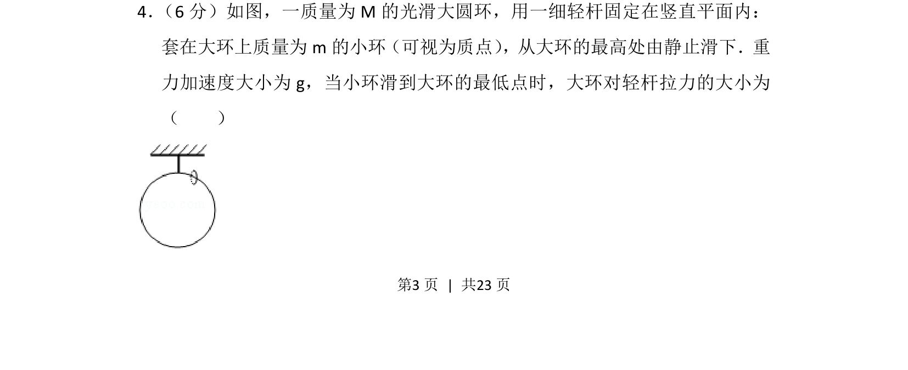
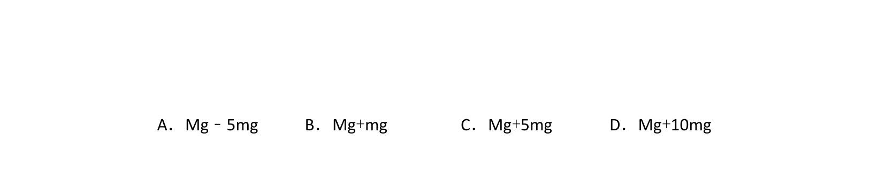
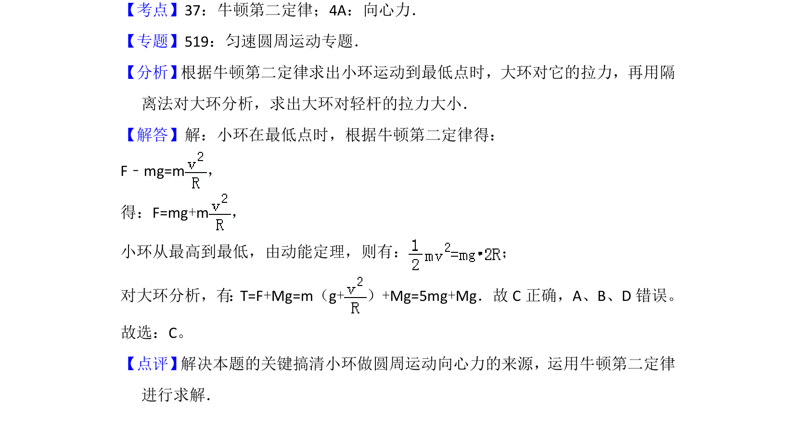

## 题面

## 摘要

小环从大环最高点滑至最低点，求此时大环对轻杆的拉力大小。

## 关联考点

- [[572-圆周运动向心力|圆周运动向心力]]
- [[251-动能定理|动能定理]]
- [[229-牛顿第二定律|牛顿第二定律]]

## 答案与解析

> 📄 原 PDF 第 3 页：`素材/真题/吉林/2008-2024·（吉林）物理高考真题/2014年高考物理试卷（新课标Ⅱ）（解析卷）.pdf`
