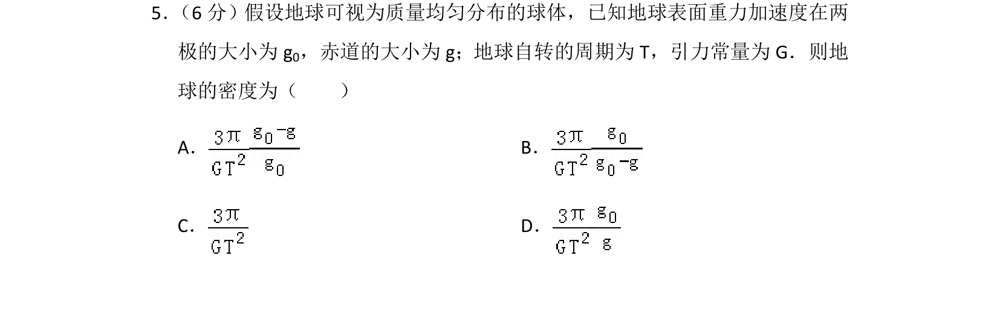
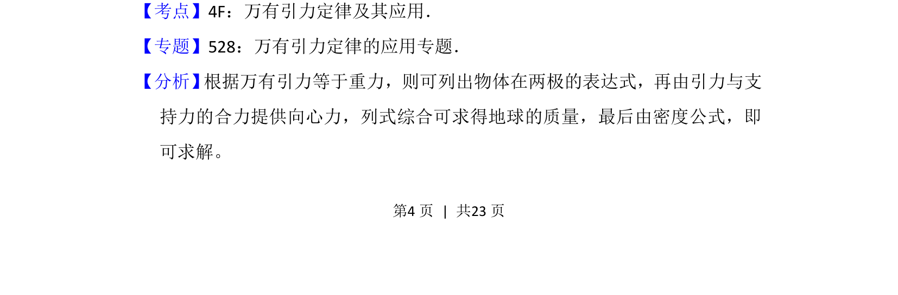
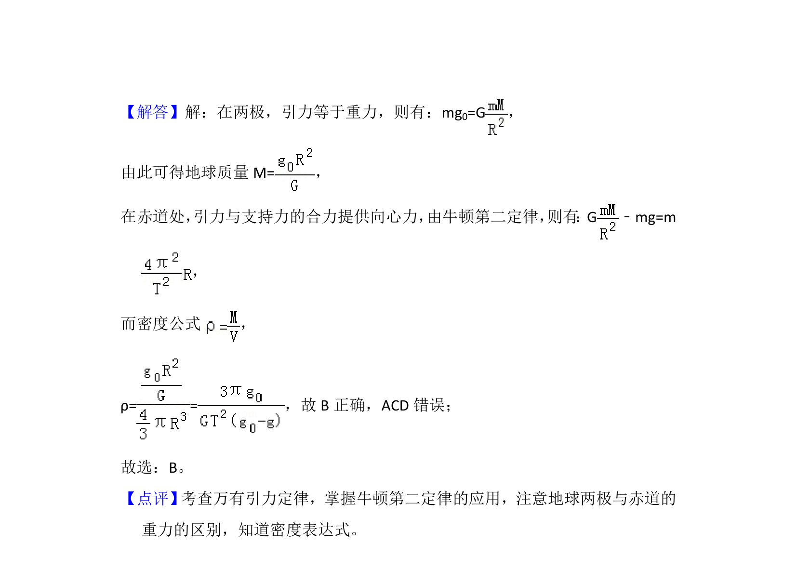

## 题面

## 摘要

该题利用地球两极和赤道重力加速度差异，结合自转周期和引力常量求地球密度。

## 关联考点

- [[246-万有引力定律|万有引力定律]]
- [[256-向心力|向心力]]
- [[021-密度公式应用|密度计算]]

## 答案与解析

> 📄 原 PDF 第 4 页：`素材/真题/吉林/2008-2024·（吉林）物理高考真题/2014年高考物理试卷（新课标Ⅱ）（解析卷）.pdf`

<!-- 题干文本-start -->
## 题干文本
5． （6分）假设地球可视为质量均匀分布的球体，已知地球表面重力加速度在两
极的大小为g 0，赤道的大小为g；地球自转的周期为T，引力常量为G．则地
球的密度为（　　）
A．B．
C．D．
<!-- 题干文本-end -->

<!-- 解析文本-start -->
## 解析文本
【考点】4F：万有引力定律及其应用．菁优网版权所有
【专题】528：万有引力定律的应用专题．
【分析】 根据万有引力等于重力，则可列出物体在两极的表达式，再由引力与支
持力的合力提供向心力，列式综合可求得地球的质量，最后由密度公式，即
可求解。
<!-- 解析文本-end -->
