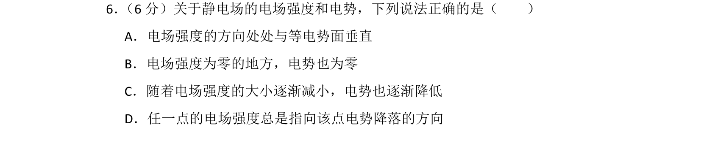
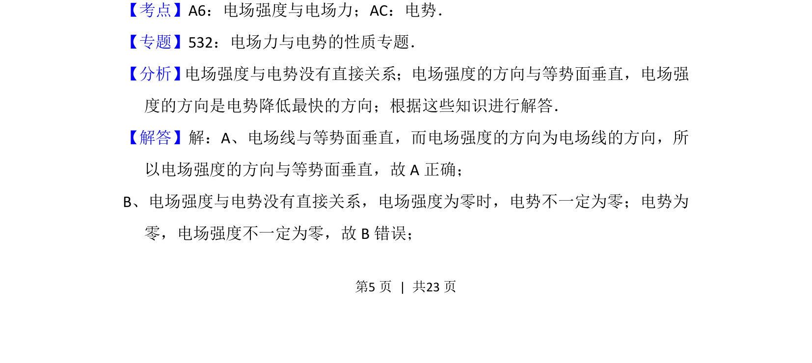
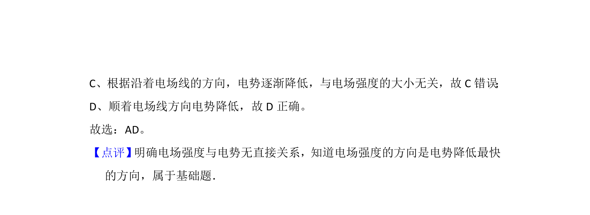

## 题面

## 摘要

本题考查静电场中电场强度与电势的基本关系，通过选项辨析常见误区。

## 关联考点

- [[277-电场强度|电场强度]]
- [[308-电势|电势]]
- [[282-等势面|等势面]]

## 答案与解析

> 📄 原 PDF 第 5 页：`素材/真题/吉林/2008-2024·（吉林）物理高考真题/2014年高考物理试卷（新课标Ⅱ）（解析卷）.pdf`

<!-- 题干文本-start -->
## 题干文本
6． （6分）关于静电场的电场强度和电势，下列说法正确的是（　　）
A．电场强度的方向处处与等电势面垂直
B．电场强度为零的地方，电势也为零
C．随着电场强度的大小逐渐减小，电势也逐渐降低
D．任一点的电场强度总是指向该点电势降落的方向
<!-- 题干文本-end -->

<!-- 解析文本-start -->
## 解析文本
【考点】A6：电场强度与电场力；AC：电势．菁优网版权所有
【专题】532：电场力与电势的性质专题．
【分析】 电场强度与电势没有直接关系；电场强度的方向与等势面垂直，电场强
度的方向是电势降低最快的方向；根据这些知识进行解答．
【解答】解：A、电场线与等势面垂直，而电场强度的方向为电场线的方向，所
以电场强度的方向与等势面垂直，故A正确；
B、电场强度与电势没有直接关系，电场强度为零时，电势不一定为零；电势为
零，电场强度不一定为零，故B错误；
<!-- 解析文本-end -->
