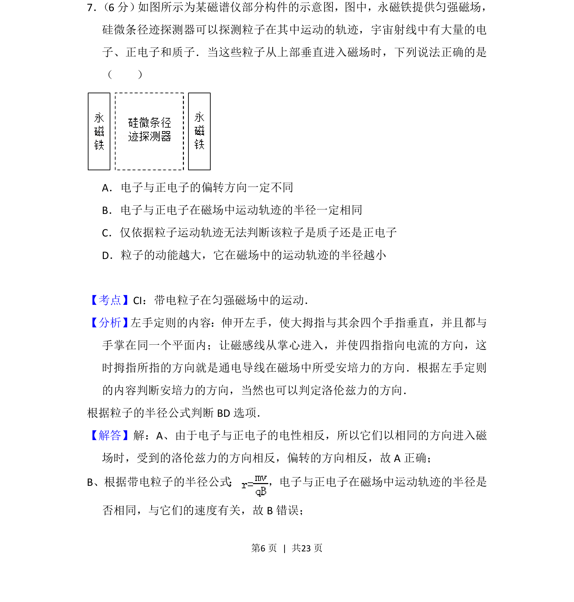
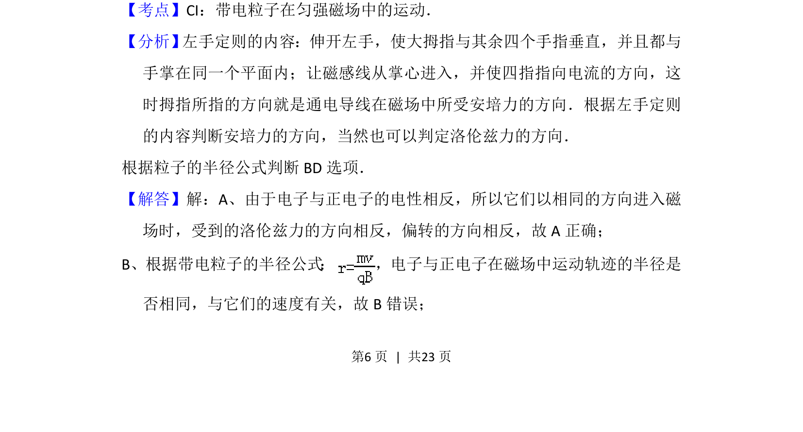
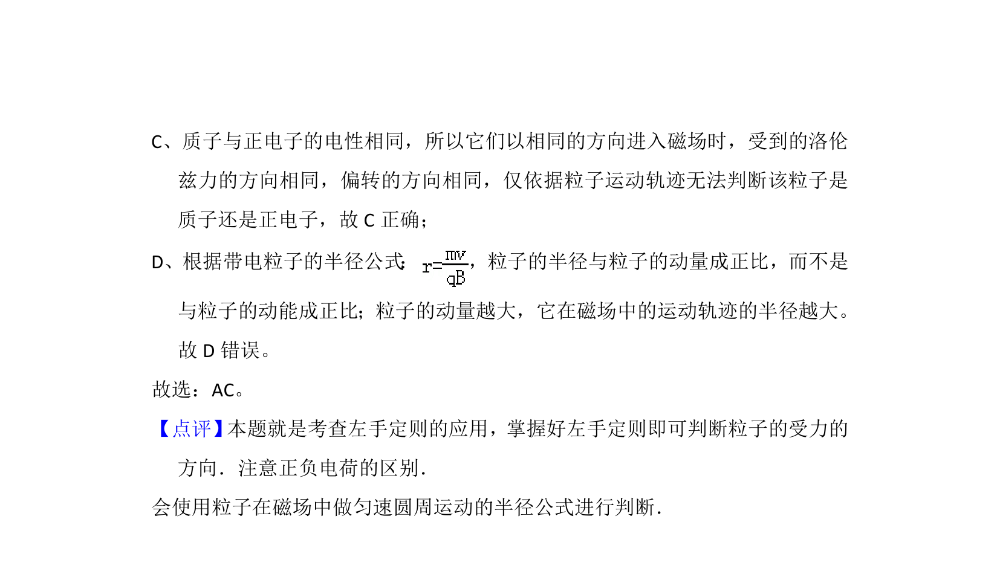

## 题面

## 摘要

带电粒子在垂直磁场中的偏转方向及运动轨迹半径的判断

## 关联考点

- [[297-安培力方向-左手定则|左手定则]]
- [[762-半径公式|半径公式]]
- [[679-电性判断|电性判断]]
- [[459-动能与半径关系|动能与半径关系]]

## 答案与解析

> 📄 原 PDF 第 6 页：`素材/真题/吉林/2008-2024·（吉林）物理高考真题/2014年高考物理试卷（新课标Ⅱ）（解析卷）.pdf`
