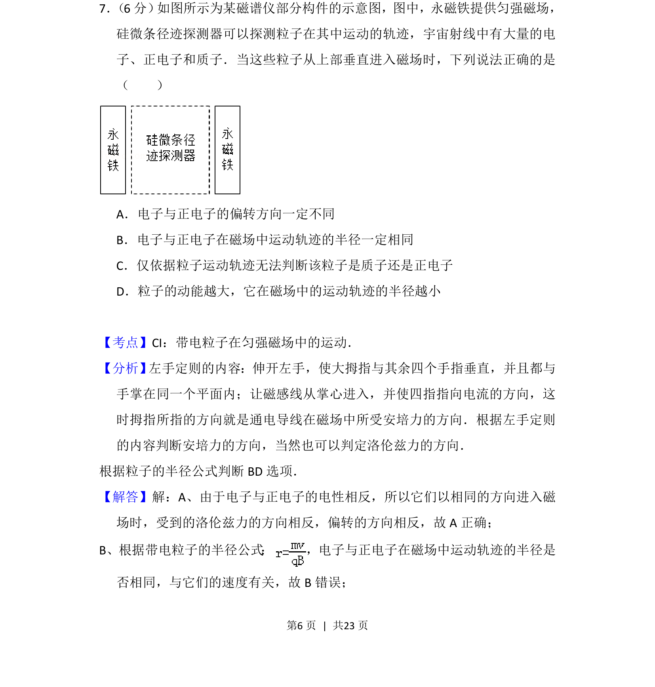
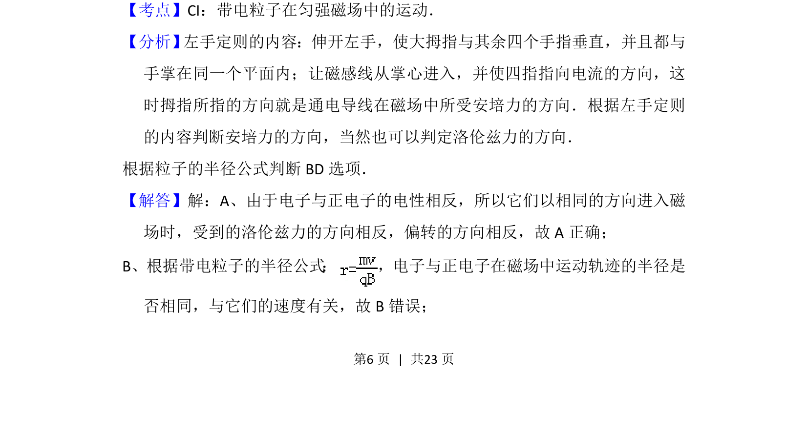
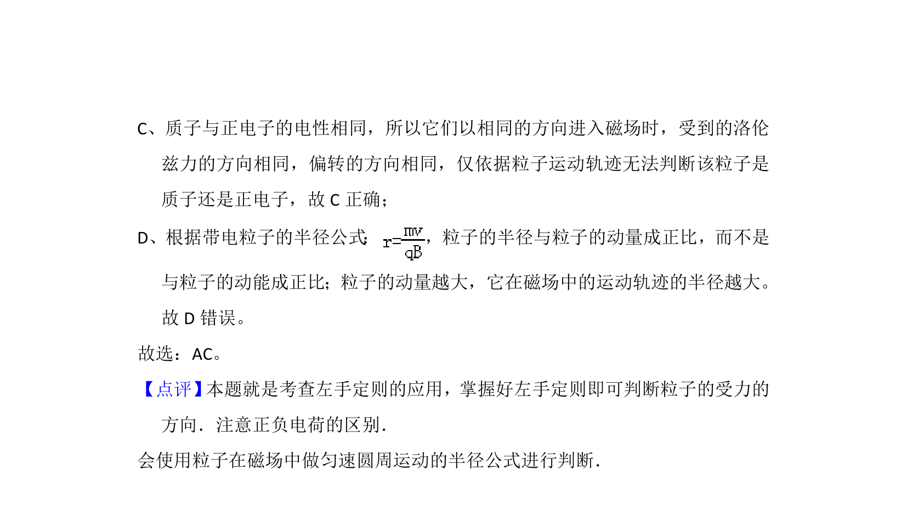

## 题面

## 摘要

带电粒子在垂直磁场中的偏转方向及运动轨迹半径的判断

## 关联考点

- [[297-安培力方向-左手定则|左手定则]]
- [[761-半径公式|半径公式]]
- [[679-电性判断|电性判断]]
- [[459-动能与半径关系|动能与半径关系]]

## 答案与解析

> 📄 原 PDF 第 6 页：`素材/真题/吉林/2008-2024·（吉林）物理高考真题/2014年高考物理试卷（新课标Ⅱ）（解析卷）.pdf`

<!-- 题干文本-start -->
## 题干文本
7． （6分） 如图所示为某磁谱仪部分构件的示意图，图中，永磁铁提供匀强磁场，
硅微条径迹探测器可以探测粒子在其中运动的轨迹，宇宙射线中有大量的电
子、正电子和质子．当这些粒子从上部垂直进入磁场时，下列说法正确的是
（　　）
A．电子与正电子的偏转方向一定不同
B．电子与正电子在磁场中运动轨迹的半径一定相同
C．仅依据粒子运动轨迹无法判断该粒子是质子还是正电子
D．粒子的动能越大，它在磁场中的运动轨迹的半径越小
<!-- 题干文本-end -->

<!-- 解析文本-start -->
## 解析文本
【考点】CI：带电粒子在匀强磁场中的运动．菁优网版权所有
【分析】 左手定则的内容：伸开左手，使大拇指与其余四个手指垂直，并且都与
手掌在同一个平面内；让磁感线从掌心进入，并使四指指向电流的方向，这
时拇指所指的方向就是通电导线在磁场中所受安培力的方向．根据左手定则
的内容判断安培力的方向，当然也可以判定洛伦兹力的方向．
根据粒子的半径公式判断BD选项．
【解答】解：A、由于电子与正电子的电性相反，所以它们以相同的方向进入磁
场时，受到的洛伦兹力的方向相反，偏转的方向相反，故A正确；
B、根据带电粒子的半径公式 ： ，电子与正电子在磁场中运动轨迹的半径是
否相同，与它们的速度有关，故B错误；
<!-- 解析文本-end -->
