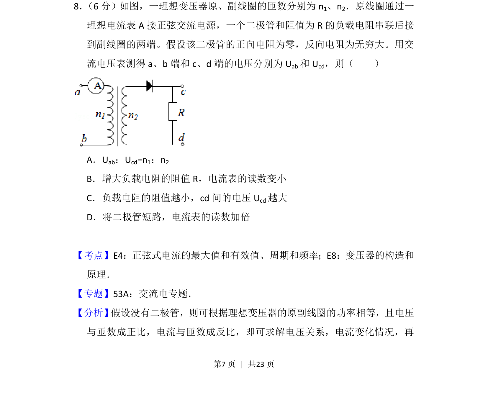
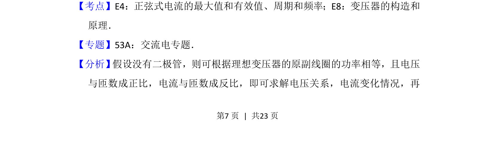
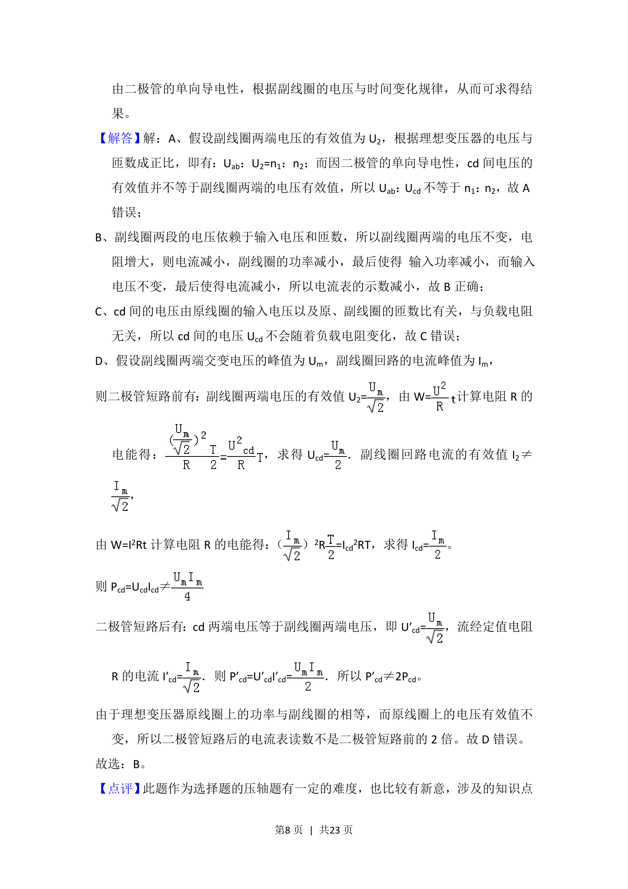
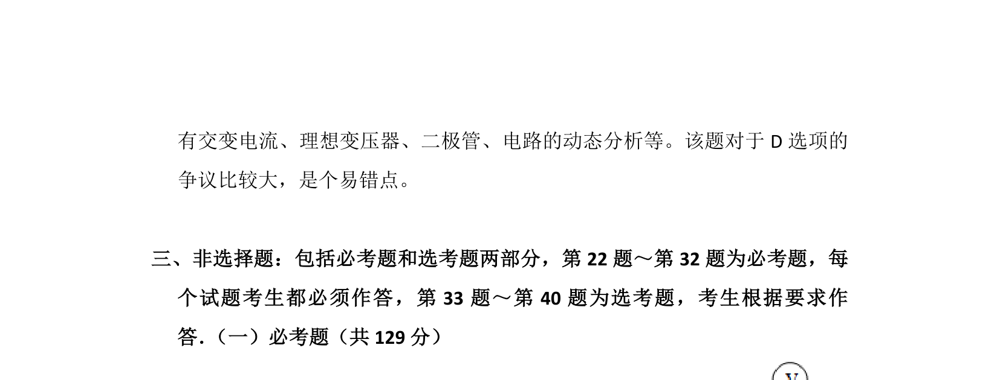

## 题面

## 摘要

本题通过理想变压器与副边含二极管的电路，考查交流电有效值及变压器原理的应用。

## 关联考点

- [[632-正弦式电流的有效值|正弦式电流的有效值]]
- [[557-变压器的构造和原理|变压器的构造和原理]]

## 答案与解析

> 📄 原 PDF 第 7 页：`素材/真题/吉林/2008-2024·（吉林）物理高考真题/2014年高考物理试卷（新课标Ⅱ）（解析卷）.pdf`

<!-- 题干文本-start -->
## 题干文本
8． （6分）如图，一理想变压器原、副线圈的匝数分别为n1、n2．原线圈通过一
理想电流表A接正弦交流电源，一个二极管和阻值为R的负载电阻串联后接
到副线圈的两端。假设该二极管的正向电阻为零，反向电阻为无穷大。用交
流电压表测得a、b端和c、d端的电压分别为U ab和U cd，则（　　）
A．Uab：Ucd=n1：n2
B．增大负载电阻的阻值R，电流表的读数变小
C．负载电阻的阻值越小，cd间的电压U cd越大
D．将二极管短路，电流表的读数加倍
<!-- 题干文本-end -->

<!-- 解析文本-start -->
## 解析文本
【考点】E4：正弦式电流的最大值和有效值、周期和频率；E8：变压器的构造和
原理．菁优网版权所有
【专题】53A：交流电专题．
【分析】 假设没有二极管，则可根据理想变压器的原副线圈的功率相等，且电压
与匝数成正比，电流与匝数成反比，即可求解电压关系，电流变化情况，再
<!-- 解析文本-end -->
