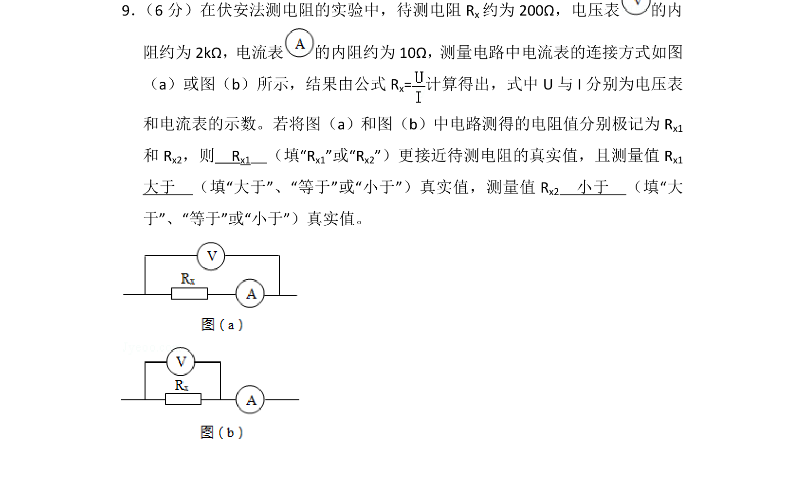
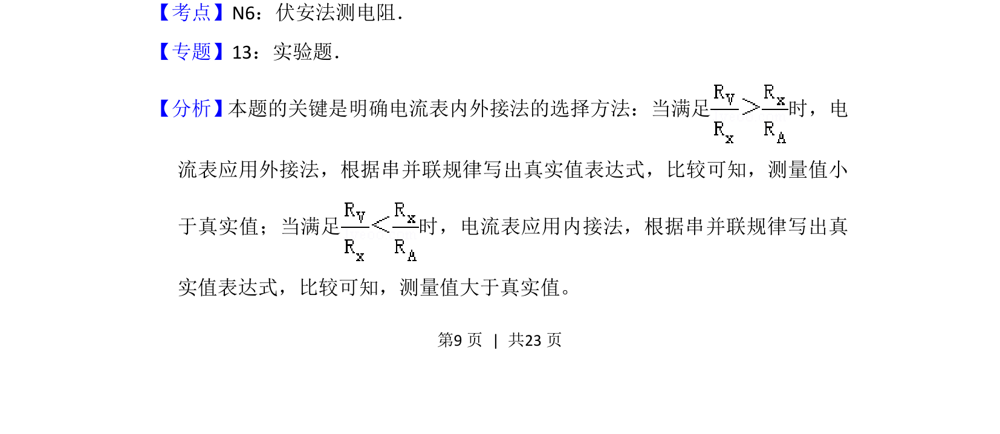
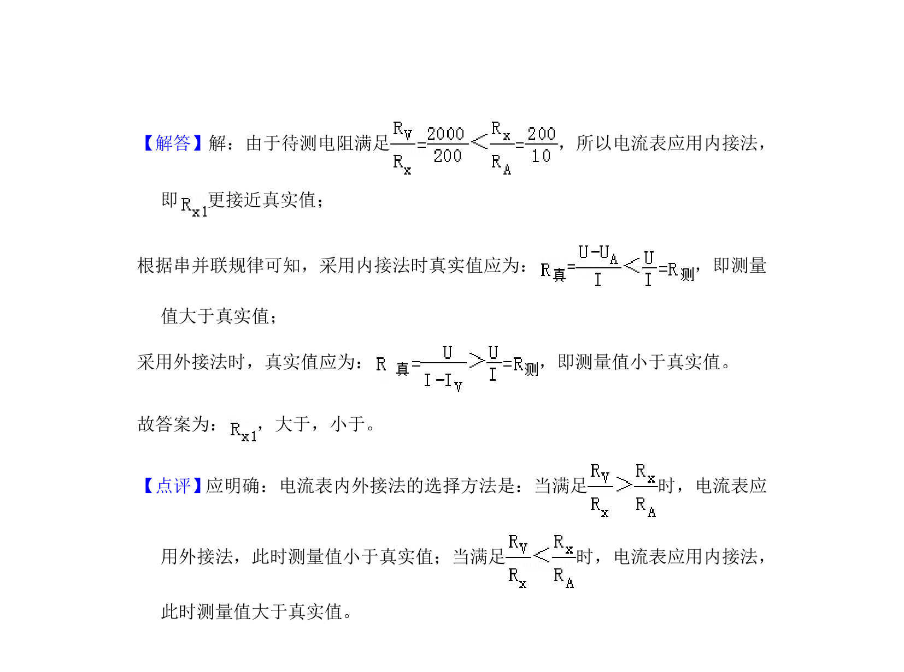

## 题面

## 摘要

伏安法测电阻实验中电流表内外接法的选择与误差分析

## 关联考点

- [[511-伏安法测电阻|伏安法测电阻]]
- [[682-电流表内接法|电流表内接法]]
- [[829-电流表外接法|电流表外接法]]
- [[724-误差分析|误差分析]]

## 答案与解析

> 📄 原 PDF 第 9 页：`素材/真题/吉林/2008-2024·（吉林）物理高考真题/2014年高考物理试卷（新课标Ⅱ）（解析卷）.pdf`

<!-- 题干文本-start -->
## 题干文本
9． （6分）在伏安法测电阻的实验中，待测电阻Rx约为200Ω，电压表 的内
阻约为2kΩ，电流表 的内阻约为10Ω，测量电路中电流表的连接方式如图
（a）或图（b）所示，结果由公式R x=计算得出，式中U与I分别为电压表
和电流表的示数。若将图（a）和图（b）中电路测得的电阻值分别极记为R x1
和R x2，则　Rx1　（填“Rx1”或“Rx2”）更接近待测电阻的真实值，且测量值R x1　
大于　（填“大于”、“等于”或“小于”）真实值，测量值R x2　小于　（填“大
于”、“等于”或“小于”）真实值。
<!-- 题干文本-end -->

<!-- 解析文本-start -->
## 解析文本
【考点】N6：伏安法测电阻．菁优网版权所有
【专题】13：实验题．
【分析】本题的关键是明确电流表内外接法的选择方法：当满足 时，电
流表应用外接法，根据串并联规律写出真实值表达式，比较可知，测量值小
于真实值；当满足 时，电流表应用内接法，根据串并联规律写出真
实值表达式，比较可知，测量值大于真实值。
<!-- 解析文本-end -->
