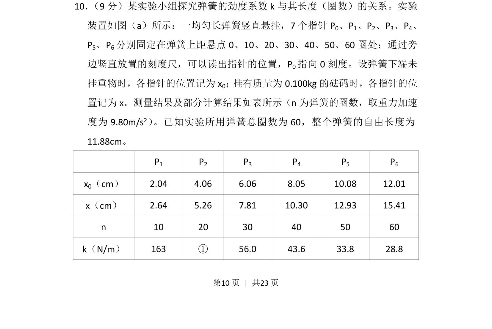
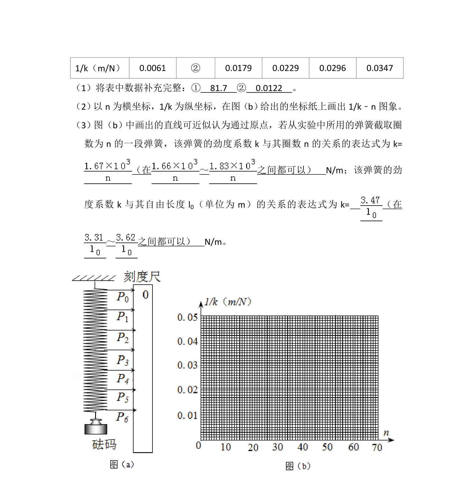
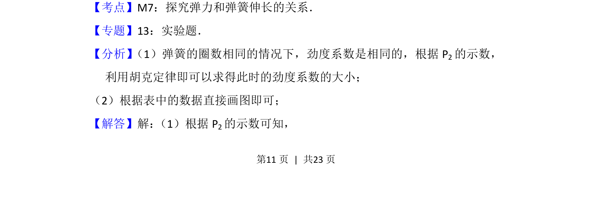
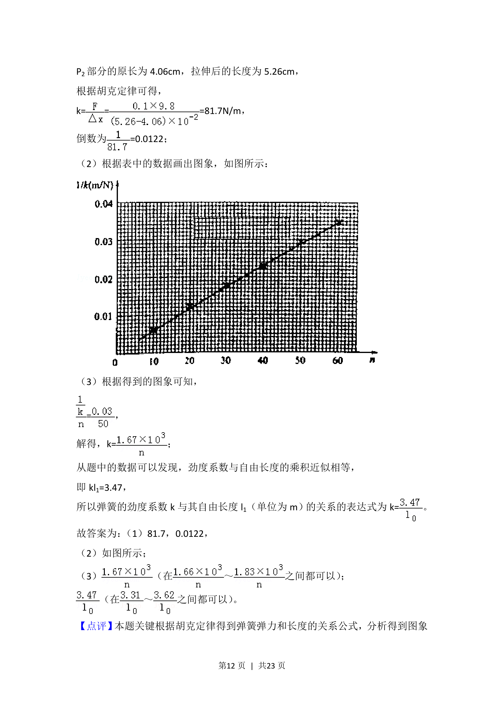

## 题面

## 摘要

该题通过弹簧实验数据测量劲度系数，涉及胡克定律应用与表格数据计算。

## 关联考点

- [[233-胡克定律|胡克定律]]
- [[1216-斜率计算|斜率计算]]
- [[901-数据处理|数据处理]]

## 答案与解析

> 📄 原 PDF 第 10 页：`素材/真题/吉林/2008-2024·（吉林）物理高考真题/2014年高考物理试卷（新课标Ⅱ）（解析卷）.pdf`

<!-- 题干文本-start -->
## 题干文本
10． （9分）某实验小组探究弹簧的劲度系数k与其长度（圈数）的关系。实验
装置如图（a）所示：一均匀长弹簧竖直悬挂，7个指针P 0、P1、P2、P3、P4、
P5、P6分别固定在弹簧上距悬点0、10、20、30、40、50、60圈处：通过旁
边竖直放置的刻度尺，可以读出指针的位置，P 0指向0刻度。设弹簧下端未
挂重物时，各指针的位置记为x 0； 挂有质量为0.100kg的砝码时，各指针的位
置记为x。测量结果及部分计算结果如表所示（n为弹簧的圈数，取重力加速
度为9.80m/s 2） 。已知实验所用弹簧总圈数为60，整个弹簧的自由长度为
<!-- 题干文本-end -->

<!-- 解析文本-start -->
## 解析文本

<!-- 解析文本-end -->
