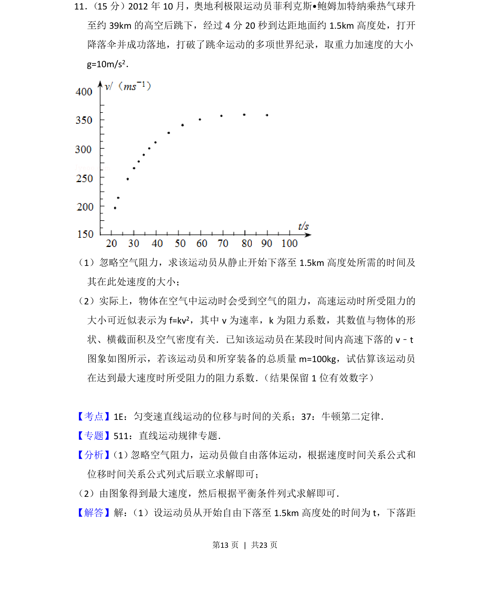

## 题面

## 摘要

通过自由落体运动求时间和速度，结合v-t图象与受力平衡估算阻力系数

## 关联考点

- [[匀变速直线运动的位移与时间的关系]]
- [[229-牛顿第二定律|牛顿第二定律]]
- [[图象分析]]
- [[平衡条件]]

## 答案与解析

> 📄 原 PDF 第 13 页：`素材/真题/吉林/2008-2024·（吉林）物理高考真题/2014年高考物理试卷（新课标Ⅱ）（解析卷）.pdf`
