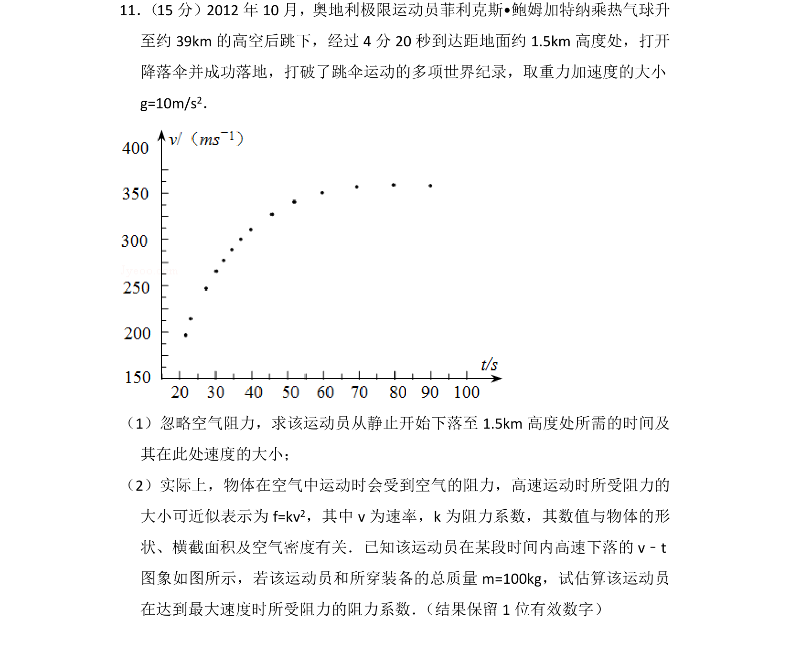
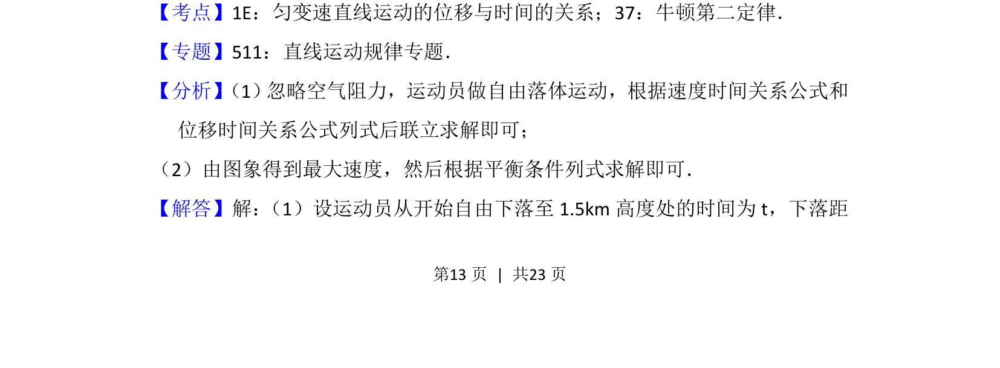
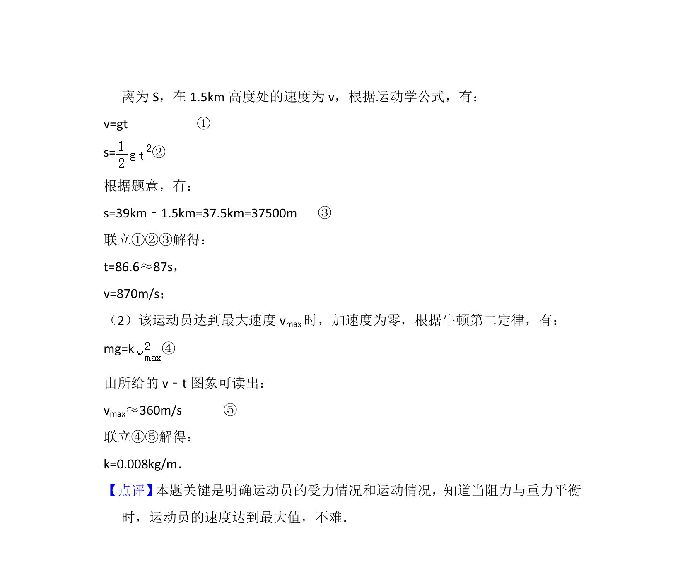

## 题面

## 摘要

通过自由落体运动求时间和速度，结合v-t图象与受力平衡估算阻力系数

## 关联考点

- [[543-匀变速直线运动的位移与时间的关系|匀变速直线运动的位移与时间的关系]]
- [[229-牛顿第二定律|牛顿第二定律]]
- [[564-图像分析|图象分析]]
- [[604-平衡条件|平衡条件]]

## 答案与解析

> 📄 原 PDF 第 13 页：`素材/真题/吉林/2008-2024·（吉林）物理高考真题/2014年高考物理试卷（新课标Ⅱ）（解析卷）.pdf`

<!-- 题干文本-start -->
## 题干文本
11． （15分）2012年10月，奥地利极限运动员菲利克斯•鲍姆加特纳乘热气球升
至约39km的高空后跳下，经过4分20秒到达距地面约1.5km高度处，打开
降落伞并成功落地，打破了跳伞运动的多项世界纪录，取重力加速度的大小
g=10m/s2．
（1）忽略空气阻力，求该运动员从静止开始下落至1.5km高度处所需的时间及
其在此处速度的大小；
（2）实际上，物体在空气中运动时会受到空气的阻力，高速运动时所受阻力的
大小可近似表示为f=kv 2，其中v为速率，k为阻力系数，其数值与物体的形
状、横截面积及空气密度有关．已知该运动员在某段时间内高速下落的v﹣t
图象如图所示，若该运动员和所穿装备的总质量m=100kg，试估算该运动员
在达到最大速度时所受阻力的阻力系数． （结果保留1位有效数字）
<!-- 题干文本-end -->

<!-- 解析文本-start -->
## 解析文本
【考点】1E：匀变速直线运动的位移与时间的关系；37：牛顿第二定律．菁优网版权所有
【专题】511：直线运动规律专题．
【分析】 （1） 忽略空气阻力，运动员做自由落体运动，根据速度时间关系公式和
位移时间关系公式列式后联立求解即可；
（2）由图象得到最大速度，然后根据平衡条件列式求解即可．
【解答】解： （1）设运动员从开始自由下落至1.5km高度处的时间为t，下落距
<!-- 解析文本-end -->
