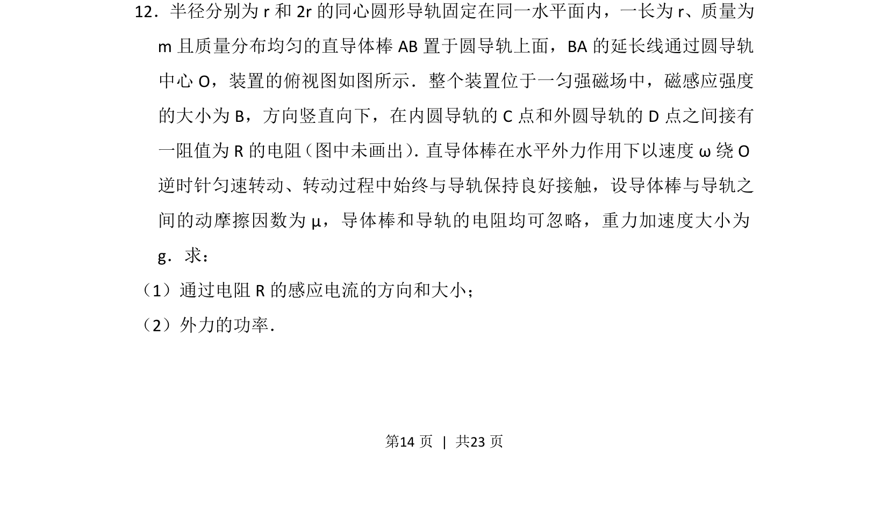
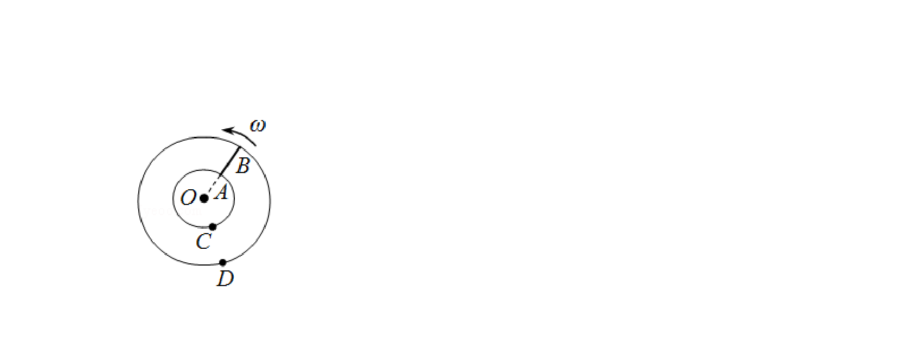
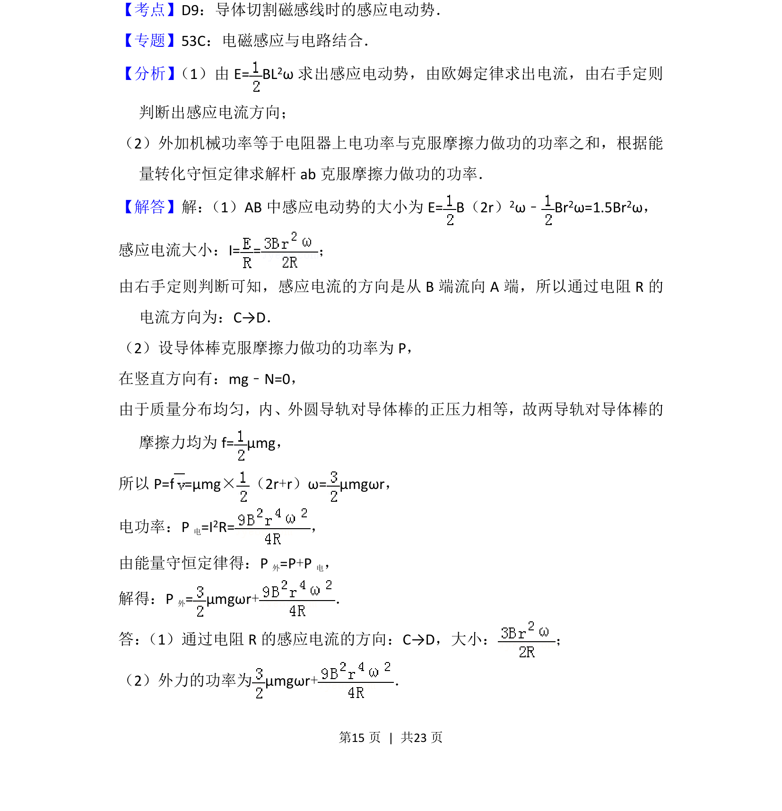
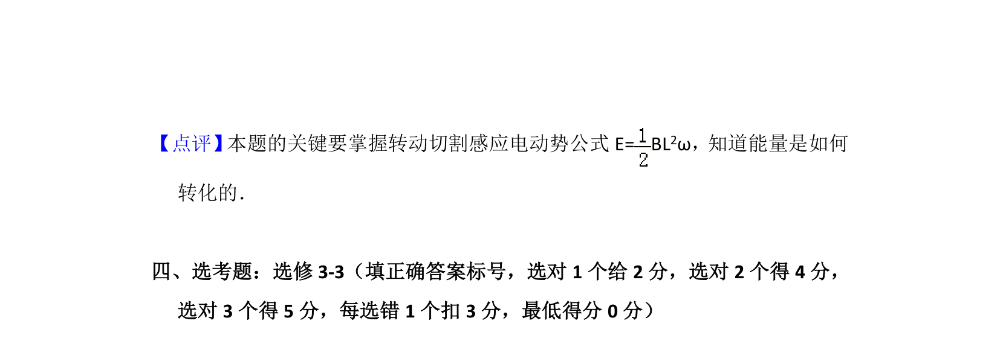

## 题面

## 摘要

该题考查导体棒在匀强磁场中绕轴转动切割磁感线产生的感应电动势，并综合摩擦力与功率计算。

## 关联考点

- [[175-电磁感应|电磁感应]]
- [[729-转动切割|转动切割]]
- [[141-欧姆定律-初中|欧姆定律]]
- [[063-功率|功率]]

## 答案与解析

> 📄 原 PDF 第 14 页：`素材/真题/吉林/2008-2024·（吉林）物理高考真题/2014年高考物理试卷（新课标Ⅱ）（解析卷）.pdf`
