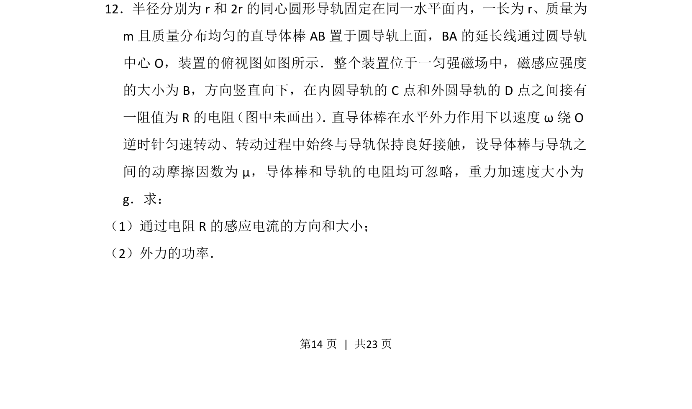
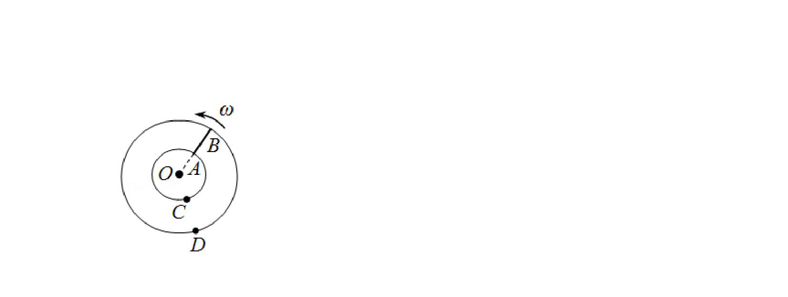
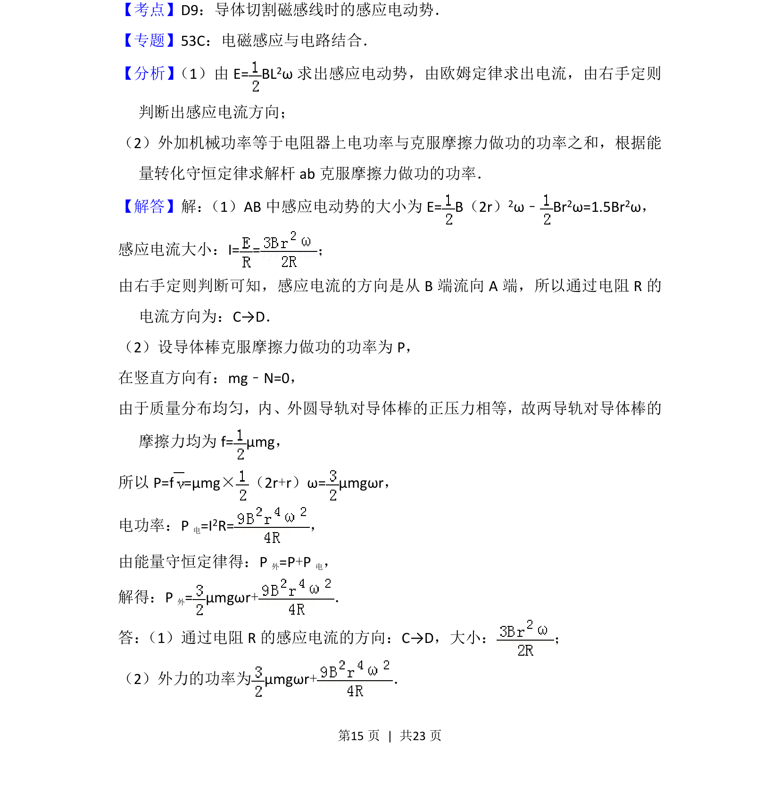
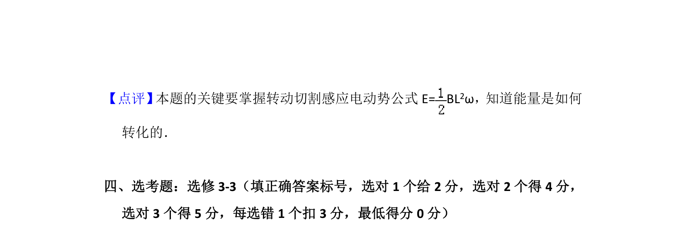

## 题面

## 摘要

该题考查导体棒在匀强磁场中绕轴转动切割磁感线产生的感应电动势，并综合摩擦力与功率计算。

## 关联考点

- [[175-电磁感应|电磁感应]]
- [[729-转动切割|转动切割]]
- [[141-欧姆定律-初中|欧姆定律]]
- [[063-功率|功率]]

## 答案与解析

> 📄 原 PDF 第 14 页：`素材/真题/吉林/2008-2024·（吉林）物理高考真题/2014年高考物理试卷（新课标Ⅱ）（解析卷）.pdf`

<!-- 题干文本-start -->
## 题干文本
12．半径分别为r和2r的同心圆形导轨固定在同一水平面内，一长为r、质量为
m且质量分布均匀的直导体棒AB置于圆导轨上面，BA的延长线通过圆导轨
中心O，装置的俯视图如图所示．整个装置位于一匀强磁场中，磁感应强度
的大小为B，方向竖直向下，在内圆导轨的C点和外圆导轨的D点之间接有
一阻值为R的电阻 （图中未画出） ． 直导体棒在水平外力作用下以速度ω绕O
逆时针匀速转动、转动过程中始终与导轨保持良好接触，设导体棒与导轨之
间的动摩擦因数为μ，导体棒和导轨的电阻均可忽略，重力加速度大小为
g．求：
（1）通过电阻R的感应电流的方向和大小；
（2）外力的功率．
<!-- 题干文本-end -->

<!-- 解析文本-start -->
## 解析文本

<!-- 解析文本-end -->
