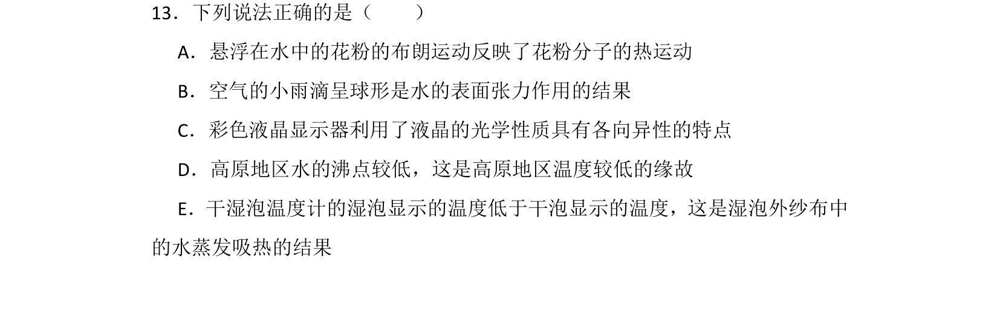
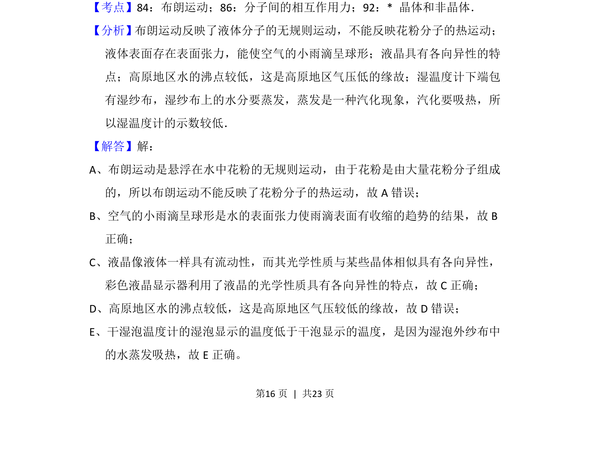

## 题面

## 摘要

本题考查热学中布朗运动、表面张力、液晶特性、沸点与气压及蒸发吸热等知识点。

## 关联考点

- [[130-分子热运动|布朗运动]]
- [[分子间相互作用力]]
- [[晶体和非晶体]]

## 答案与解析

> 📄 原 PDF 第 16 页：`素材/真题/吉林/2008-2024·（吉林）物理高考真题/2014年高考物理试卷（新课标Ⅱ）（解析卷）.pdf`
